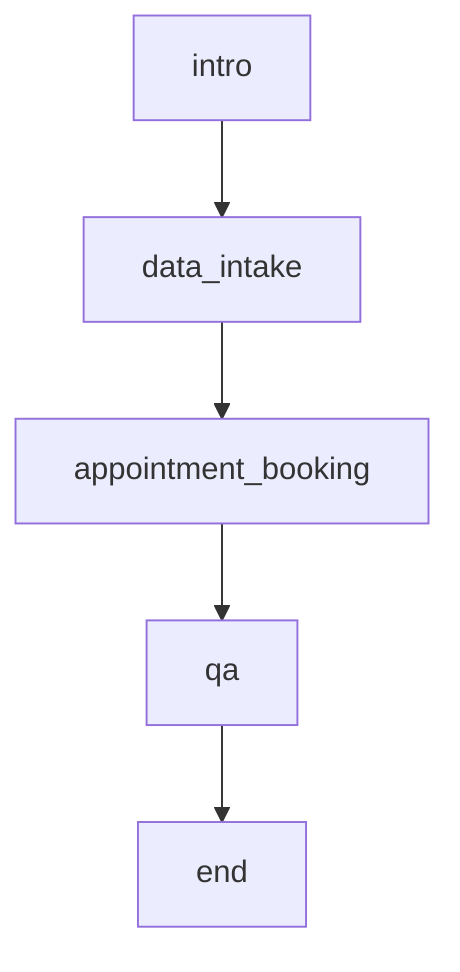

This example scenario shows how to run a full patient screening conversation that collects intake details, schedules an appointment, answers clinic questions, and then closes the session cleanly.

## What this example shows

- Scenario creation and node configuration
- Endpoint usage for HTTP calls
- Knowledge base integration for RAG-driven answers
- Runtime variables for `patient_id`, `today`
- Connecting the scenario to the Web SDK examples

## Node flow

The scenario is structured around the following node sequence:

- `intro`
  - Greet the patient warmly and introduce yourself as a medical screening assistant.
  - Uses `transition` tools.
- `data_intake`
  - Collect the patient's basic information.
  - Uses `transition`, `vision` tools.
- `appointment_booking`
  - Help the patient schedule an appointment.
  - Uses `http` tools.
- `qa`
  - Answer the patient's questions about the screening process, our clinic, or anything else they want to know.
  - Uses `transition`, `rag` tools.
- `end`
  - Thank the patient for completing the screening.
  - Ends the conversation after the assistant responds.



## Secrets

Create these secrets in the [Akapulu secrets tab](https://akapulu.com/secrets):

- **Create secret**
  - Name: `webhook_token`
  - Example value: `webhook_secret_123`

## Endpoints

### Patient Intake Book Appointment

Use your hosted endpoint URL below.

- **Setup tab**
  - Name: `Patient Intake Book Appointment`
  - URL: `https://<YOUR_HOSTED_ENDPOINT_DOMAIN>/book-appointment`
  - Method: `POST`

- **Headers/Body tab**
  - `headers`:

    ```json
    {
      "Content-Type": "application/json",
      "X-Patient-ID": "{{runtime.patient_id}}",
      "Authorization": "Bearer {{secret.webhook_token}}"
    }
    ```

  - `body`:

    ```json
    {
      "date": "{{llm.date:Appointment date in YYYY-MM-DD}}",
      "time": "{{llm.time:Appointment time in HH:MM 24-hour}}",
      "appointment_type": "{{llm.appointment_type:Type like follow_up or new_consult}}",
      "patient_id": "{{runtime.patient_id}}",
      "source": "patient_intake_screening"
    }
    ```

## Knowledge bases

### Healthcare Intake Demo Knowledge Base

- **Knowledge base details**
  - Name: `Healthcare Intake Demo Knowledge Base`
  - Description: `Reference information for the Healthcare Intake & Scheduling demo scenario, including clinic policies, appointment details, and patient-facing FAQ content.`

- **Document details**
  - Name: `Clinic Details`
  - Description: `Clinic operations, hours, policies, and scheduling information used by the demo assistant for patient Q&A.`

- **Upload this file**
  - [`Clinic-Details.md`](https://github.com/Akapulu/akapulu-examples/blob/main/example-scenarios/healthcare-intake-scheduling/Clinic-Details.md)

## Node JSON to paste

Replace these placeholders:

- `<YOUR_BOOK_APPOINTMENT_ENDPOINT_ID>`
- `<YOUR_ABOUT_OUR_CLINIC_KNOWLEDGE_BASE_ID>`

```json
{
  "role_instruction": "You are a friendly and professional medical screening assistant. Your responses will be converted to audio, so keep them concise and avoid special characters. Speak clearly and warmly to help patients feel comfortable. Do not start sentences with short bursts like sure! or absolutely! since short bursts lead to choppy audio.",
  "nodes": {
    "intro": {
      "functions": [
        {
          "name": "transition_to_data_intake",
          "type": "transition",
          "description": "Use this function to transition to the data_intake phase after they have given consent to proceed.",
          "transition_to": "data_intake"
        }
      ],
      "task_instruction": "Greet the patient warmly and introduce yourself as a medical screening assistant. Explain that you'll help them with a brief screening questionnaire. After they have given consent to move to next stage, use the transition tool to move forward to the data intake phase."
    },
    "data_intake": {
      "functions": [
        {
          "name": "transition_to_appointment_booking",
          "type": "transition",
          "description": "Transition to the appointment booking phase.",
          "transition_to": "appointment_booking"
        },
        {
          "name": "VIEW_CAMERA",
          "type": "vision",
          "description": "Use this tool when the user asks you to look at the screen"
        }
      ],
      "task_instruction": "Collect the patient's basic information. Ask for their full name, age, primary reason for visit, and any current symptoms or concerns. Be conversational and ask one question at a time. If the patient indicates they are showing something on camera (for example: this part of my hand hurts, can you see this rash, what does this look like), call the vision tool. When you've gathered enough information, use the transition tool to move to appointment booking. If the patient asks questions, politely redirect them to answer the screening questions first, and mention they can ask questions later in the Q&A phase."
    },
    "appointment_booking": {
      "functions": [
        {
          "name": "book_appointment",
          "type": "http",
          "description": "Call this tool to book the appointment",
          "endpoint_id": "<YOUR_BOOK_APPOINTMENT_ENDPOINT_ID>",
          "transition_to": "qa"
        }
      ],
      "task_instruction": "Help the patient schedule an appointment. Ask about their preferred date and time, and whether they prefer in-person or virtual consultation. Be flexible and accommodating. When you've collected the appointment details (date, time, and appointment type), use the HTTP booking tool.\n\nNote - today is {{runtime.today}}"
    },
    "qa": {
      "functions": [
        {
          "name": "transition_to_end_screening",
          "type": "transition",
          "description": "Transition to the end of the screening session.",
          "transition_to": "end"
        },
        {
          "name": "about_our_clinic",
          "type": "rag",
          "knowledge_base_id": "<YOUR_ABOUT_OUR_CLINIC_KNOWLEDGE_BASE_ID>",
          "description": "a RAG tool with information about our clinic"
        }
      ],
      "task_instruction": "Answer the patient's questions about the screening process, our clinic, or anything else they want to know. Be helpful, empathetic, and professional. If you don't know something, suggest they discuss it with their doctor during the appointment. Keep responses concise since they'll be converted to audio. Use the transition tool to end the screening session when the patient is ready to conclude. If they have a question about our clinic use the about_our_clinic rag tool"
    },
    "end": {
      "task_instruction": "Thank the patient for completing the screening. Provide a brief summary of next steps (e.g., 'We'll review your information and confirm your appointment details. A member of our team will contact you soon.'). Keep it brief and friendly, then end the conversation.",
      "end_after_bot_response": true
    }
  },
  "initial_node": "intro"
}
```

## Use in UI

This repository also includes demo applications built with the Web SDK under:

```text
fundamentals/
  prebuilt-ui/
  custom-ui/
```

Related docs pages:

- [Prebuilt UI](https://docs.akapulu.com/examples/basic/prebuilt-ui)
- [Custom UI](https://docs.akapulu.com/examples/basic/custom-ui)
- [Avatar Catalog](https://docs.akapulu.com/guides/avatars/avatar-catalog)

In your connect route, pass `scenario_id`, `avatar_id`, and runtime variables required by this scenario (`patient_id`, `today`), for example:

```ts
return await akapulu.connectConversation({
  scenario_id: "<your-scenario-id>",
  avatar_id: "<your-avatar-id>",
  stt_keywords: [
    "medication",
    "prescription",
    "virtual",
  ];,
  runtime_vars: {
    patient_id: "patient_001",
    today: new Date().toISOString().slice(0, 10),
  };
  record_conversation: true,
});
```

## View on GitHub

- [example-scenarios/healthcare-intake-scheduling](https://github.com/Akapulu/akapulu-examples/tree/main/example-scenarios/healthcare-intake-scheduling)
