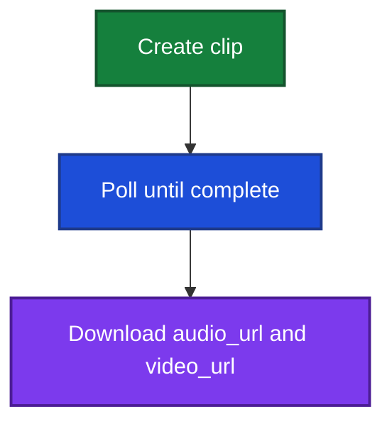

This guide is the end-to-end flow for creating avatar video clips over the REST API.

Phonemes come back on the create response. Poll the clip until `video_url` is set, then download.

Credits are in [Overview](/guides/clips/overview#credits).

## Flow



## 1. Create a clip

`POST /api/clips/create/`

Send `avatar_id` and **exactly one** of `text` or `phonemes`. Optional `name` (defaults to the spoken line, max 120 characters). Optional `show_ai_label` and `show_logo` (both default `true`).

If you send `text`, we convert it to [phonemes](/guides/clips/phonemes) internally, then synthesize from that string. Pass `phonemes` yourself when you want tighter control over how words are pronounced. Do not send both.

```json
{
  "name": "Product intro",
  "avatar_id": "1f777f64-3758-4a7d-9cbc-c64ae654f7d1",
  "text": "Welcome to Acme. Thanks for watching."
}
```

Or pass phonemes directly:

```json
{
  "avatar_id": "1f777f64-3758-4a7d-9cbc-c64ae654f7d1",
  "phonemes": "wˈɛlkəm tu ˈækmi. θˈæŋks fɔɹ wˈɑʧɪŋ."
}
```

Use a [catalog avatar](/guides/avatars/avatar-catalog) `avatar_id`, or one of your own (private avatars require an enterprise plan).

Returns the clip: `id`, `status` (`generating`), `text`, `phonemes` (the converted string if you sent `text`), `audio_url` / `video_url` as `null`, plus `credits_charged` and `estimated_seconds`.

If there are not enough credits, the request fails and no clip is created.

`show_logo: false` requires [Starter](https://akapulu.com/pricing) or higher. `show_ai_label` can be `false` on any plan. How the overlays work is in [AI content disclosure](/guides/clips/ai-content-disclosure).

## 2. Poll until complete

`GET /api/clips/<clip_id>/`

Watch `status`. `audio_url` and `video_url` stay `null` until those files exist.

When `status` is `complete`, both URLs are hour-long HTTPS download links. If a link expired, call GET again for a fresh pair.

| `status` | Meaning |
| --- | --- |
| `generating` | Job is running |
| `complete` | `audio_url` and `video_url` are available |
| `failed` | See `error` |

## Credits

Clip jobs use the same credit pool as live conversations and LLM test sessions.

Credits are charged on create: **1 credit per estimated minute** of generated video. If the job fails after that debit, the charge is refunded.

Also: [Phonemes](/guides/clips/phonemes) · [AI content disclosure](/guides/clips/ai-content-disclosure) · [Python example](/examples/clips/scripted-clip-workflow)
