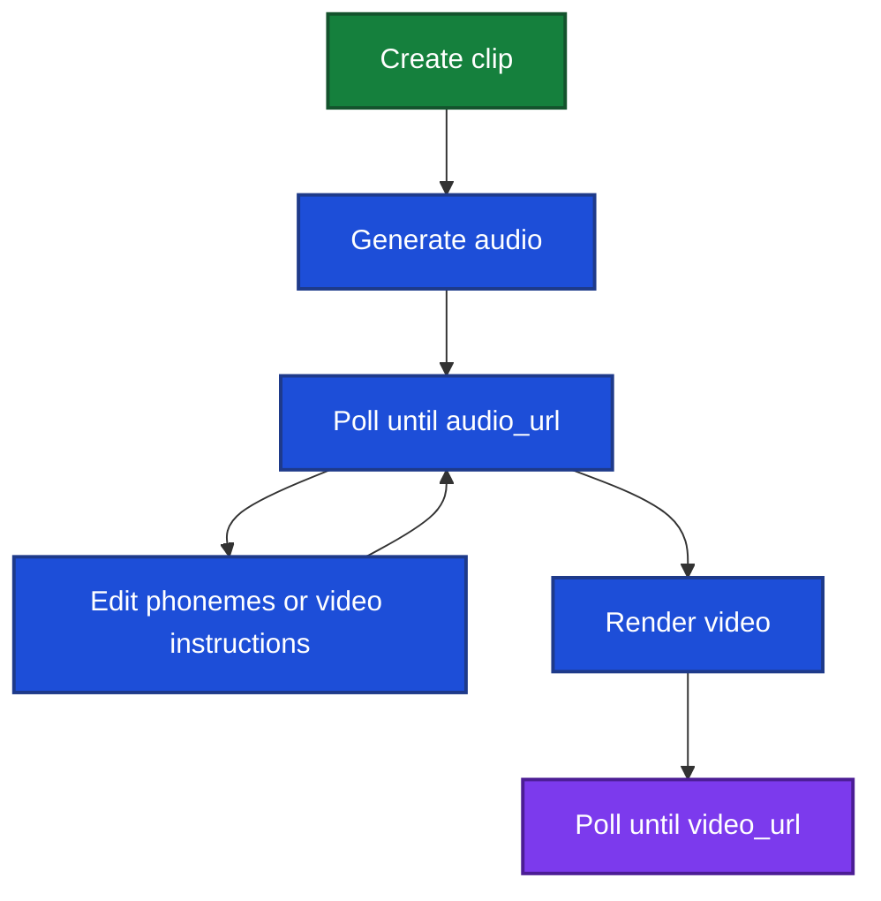

This guide is the end-to-end flow for creating avatar video clips over the REST API.

Creating a take generates **audio**. When `audio_url` is set, you can download it, edit pronunciation or video instructions, then start the **video** render.

Audio and video are separate on purpose. Video takes a long time and a lot of credits. Audio is relatively quick and cheap, so we recommend you refine pronunciation, timing, and the face / upper-body instructions where you want them before you start the video job. Approximate times and costs for a full job are in [Overview](/guides/clips/overview#why-audio-and-video-are-separate).

## Flow



## 1. Create a clip

`POST /api/clips/create/`

```json
{
  "name": "Product intro"
}
```

Returns the clip, including `id` (use this in later URLs).

Now that we've created our first clip, we need to generate the first take within that clip.

## 2. Generate audio

`POST /api/clips/<clip_id>/takes/` creates a take and starts TTS. Send `avatar_id` and **exactly one** of `text` or `phonemes`. Optional `name` (defaults to `Take N` where N is number of existing takes + 1).

If you send `text`, we convert it to [phonemes](/guides/clips/phonemes) internally, then synthesize audio from that string. Pass `phonemes` yourself when you want tighter control over how words are pronounced. Do not send both.

```json
{
  "avatar_id": "66666666-7777-8888-9999-000000000000",
  "text": "Welcome to Acme. Thanks for watching."
}
```

Or pass phonemes directly:

```json
{
  "avatar_id": "66666666-7777-8888-9999-000000000000",
  "phonemes": "lˈʊk ðə pɹˈIs"
}
```

Returns the take: `id`, `status` (`starting_tts`), `text`, `phonemes` (the converted string if you sent `text`), and `audio_url` / `video_url` as `null`. Also `credits_charged` and `estimated_seconds`.

Listen to the audio once `audio_url` is set (next step). If a pronunciation is off, edit the [phonemes](/guides/clips/phonemes) string and send it as `phonemes` on a new generate-audio request.

If there are not enough credits, the request fails and no take is created.

## 3. Poll until audio is ready

`GET /api/clips/<clip_id>/takes/<take_id>/` to poll the status of the audio creation job.

Watch `status` and `audio_url`. `audio_url` stays `null` until the audio is ready.

When the status is `ready_to_render`, the `audio_url` will be a download link and `chunk_prompts` will have the face / upper-body instructions per each **2.5-3 second** audio chunk.

### Audio status fields

| `status` | Meaning |
| --- | --- |
| `starting_tts` | Audio job is starting |
| `generating_audio` | Synthesizing speech |
| `generating_motion_instructions` | Writing face / upper-body instructions |
| `ready_to_render` | Audio is ready; you can edit or render |
| `failed` | See `error` |

## Video instructions

From the generated audio we cut the take into **chunks** of about **2.5–3 seconds** and attach two video instructions to each chunk:

- `face_prompt` — head and face (expression, eyebrows, gaze, emotion)
- `upper_body_prompt` — shoulders, arms, and hands

We **generate these automatically** from the spoken line. These instructions steer look, emotion, and leftover body motion.

**Leave them as generated** unless you want a very specific behavior on a given chunk.

Assume each chunk is about **60 to 75 frames**. Frame `0` is locked (the still, or the end of the previous chunk), so a gesture cannot start already fully extended. Put the hands down before the last ~10 frames so a raised pose does not carry into the next chunk.

Time a move with `*frames start~end*` on the same line:

```
Step 1: *frames 19~32* A lady faces the camera, right hand rises to chest height with the palm open. Step 2: *frames 33~48* The right hand lowers back to her side. Step 3: *frames 50~72* Both hands rest at her sides, torso still, eyes on camera.
```

**Defaults** (what we write on most chunks):

Face:

```
A lady/man is talking with animated facial expressions, frequently raising and arching the eyebrows for emphasis. Only the foreground is moving, the background remains static.
```

Upper body:

```
A lady/man is talking to the camera with natural movements while speaking. The torso and shoulders stay steady. Only the foreground person is moving, the background remains static.
```

A few chunks get a real gesture (greeting, thanks, emphasis). The rest stay on those defaults. Changing phonemes rebuilds audio **and** regenerates the chunks; editing instructions does not change how many chunks there are or when they start.

Example: one take, three chunks. Chunk 0 is a greeting; 1 is the default; 2 is a small fidget:

```
Spoken audio (~8s)
"Hey everyone, welcome back. Today I want to show you how easy this is to set up."

Chunk 0  (~0–3s)  "Hey everyone, welcome back."
  face_prompt:  (default)
  upper_body_prompt:
    Step 1: *frames 19~32* A lady faces the camera, right hand rises to
    chest height with the palm open, torso steady. Step 2: *frames 33~48*
    The right hand lowers back to her side. Step 3: *frames 50~72* Both
    hands rest at her sides, torso still, eyes on camera.

Chunk 1  (~3–5.5s)  "Today I want to show you"
  face_prompt:  (default)
  upper_body_prompt:  (default)

Chunk 2  (~5.5–8s)  "how easy this is to set up."
  face_prompt:  (default)
  upper_body_prompt:
    Step 1: *frames 22~40* A lady faces the camera, fingers of the left
    hand shift and resettle on her lap, wrist barely moving, arms stay
    down. Step 2: *frames 42~72* Hands still at rest, torso quiet, eyes
    on camera.
```

### How to prompt

Only edit a chunk if you need a specific look or gesture there. Otherwise keep the defaults.

**Face.** Expression, eyebrows, gaze. Do not mention hands.

**Upper body.** Name each starting, intermediate, and ending state. Use `*frames start~end*` so the move sits on the spoken beat.

## 4. Edit phonemes or video instructions (optional)

Phonemes and video instructions can be changed **before** render starts. After render has started, those edits fail with `Take video has already started`.

### Phonemes

`POST /api/clips/<clip_id>/takes/<take_id>/phonemes/` with a `phonemes` string. Optional `text` relabels the line; omit it to keep the existing `text`. See [Phonemes](/guides/clips/phonemes) for the alphabet.

This regenerates audio (and the video instructions that go with it). If there are not enough credits, the request fails and the take is left unchanged. It also fails if audio is still in progress. Poll again until `audio_url` is set.

Returns `id`, `text`, `phonemes`, `estimated_seconds`, and `credits_charged`.

### Video instructions

`POST /api/clips/<clip_id>/takes/<take_id>/prompts/` with `chunk_prompts`. Each object needs `index`, `upper_body_prompt`, and `face_prompt`. Prompt edits are free and do not regenerate audio. Window count and timing stay locked.

Returns `id` and the updated `chunk_prompts`.

## 5. Render video

When `status` is `ready_to_render` and `audio_url` is set, `POST /api/clips/<clip_id>/takes/<take_id>/render/` starts video.

This locks phonemes and prompts on that take. If there are not enough credits, the request fails and the take is left unchanged.

Optional body (both default `true`):

```json
{
  "show_ai_label": true,
  "show_logo": true
}
```

`show_ai_label` overlays **This is AI** in the corner of the video. `show_logo` overlays **Made by** plus the Akapulu Labs logo. Both default to `true`.

`show_logo: false` requires [Starter](https://akapulu.com/pricing) plan or higher. Free plans will get an error if you turn the logo off.

`show_ai_label` can be `false` on any plan. We recommend setting it to `true` so people watching can tell the clip is AI-generated. Some places, including the EU, have [rules about disclosing AI-generated media](https://digital-strategy.ec.europa.eu/en/faqs/transparency-obligations-under-article-50-ai-act). Invisible watermarks and Content Credentials still go on every take if the overlays are off. Details are in [AI content disclosure](/guides/clips/ai-content-disclosure).

Poll the same GET until `status` is `complete`, then download `video_url`.

### Video status

| `status` | Meaning |
| --- | --- |
| `starting_video` | Video job is starting |
| `preparing_video` | Loading the avatar |
| `generating_face_video` | Face video |
| `generating_avatar_gestures` | Upper-body motion |
| `compositing` | Composing different video segments together |
| `applying_labels` | On-video label / logo (if those flags are on) |
| `watermarking` | Provenance watermark |
| `signing` | Signing the file |
| `complete` | `video_url` is available |
| `failed` | See `error` |

## Credits

Clip audio and video use the same credit pool as live conversations and llm test sessions.

Credits are charged when generate-audio, a phoneme rebuild, or render succeeds. If the pool cannot cover that charge, the request fails and nothing on the take changes.

Approximate credits by spoken length are on [Overview](/guides/clips/overview#why-audio-and-video-are-separate).

Also: [Phonemes](/guides/clips/phonemes) · [AI content disclosure](/guides/clips/ai-content-disclosure) · [Python example](/examples/clips/scripted-clip-workflow)
