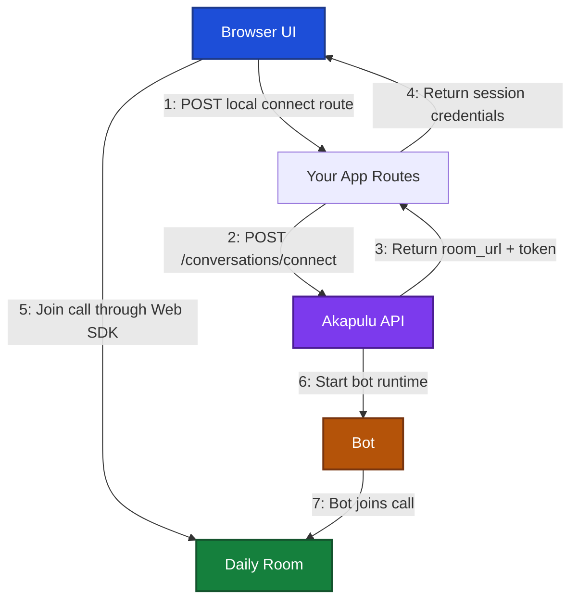

## Build your own conversation interface

The recommended way to customize the conversation experience is to use the Akapulu Web SDK.

The public Web SDK package family includes:

- `@akapulu/react`
- `@akapulu/react-ui`
- `@akapulu/server`

You have two main frontend paths:

- `@akapulu/react-ui` for a prebuilt conversation UI that you can style and customize
- `@akapulu/react` for a fully custom UI built from Akapulu hooks and primitives

Both paths use your own local server routes for `connect` and `updates`, and those server routes call the Akapulu API with `@akapulu/server`.

## Choose a path

### 1) Prebuilt UI with customization

Use this path when you want the fastest integration with room to customize styling, transcript rendering, tool-event rendering, and page behavior.

Start with:

- [Pre-built UI](/examples/basic/prebuilt-ui)

That example includes:

- `/` lists **Default** and **Styled** variants with links to each flow
- `/default` for the baseline prebuilt conversation flow
- `/styled` for a styled and behavior-customized version of the same flow
- local server routes under `app/api/default/akapulu/*` and `app/api/styled/akapulu/*`

### 2) Fully custom UI

Use this path when you want to build your own layout, transcript UI, controls, node indicators, and tool event surfaces from scratch.

Start with:

- [Custom UI](/examples/basic/custom-ui)

That example uses `@akapulu/react` without `@akapulu/react-ui`, and manually renders:

- video tiles
- loading and connection states
- transcript rows
- current node state
- tool event toasts
- mic, camera, and end-call controls

## Quickstart with `AkapuluProvider`

`AkapuluProvider` takes paths to your local API routes:

- `connectPath`: your local connect endpoint
- `updatesPath`: your local updates endpoint

The SDK calls these local routes from the browser. Your server routes then call Akapulu APIs using `@akapulu/server`.

```tsx
import { AkapuluProvider } from "@akapulu/react";
import { AkapuluConversation } from "@akapulu/react-ui";

export default function ConversationPage() {
  return (
    <AkapuluProvider
      config={{
        endpoints: {
          connectPath: "/api/akapulu/connect",
          updatesPath: "/api/akapulu/updates",
        },
      }}
    >
      <AkapuluConversation title="Akapulu demo" />
    </AkapuluProvider>
  );
}
```

## Web SDK flow

Your frontend talks to your own local server routes.

Those local server routes call the Akapulu [connect endpoint](/api-reference/conversations/connect) and [updates endpoint](/api-reference/conversations/updates) with `@akapulu/server`.



## Who is in the room

Each conversation room has two core participants:

- **Local user participant:** the browser user who joins from your frontend (camera/mic input and local UI controls).
- **Bot participant:** the Akapulu AI assistant that joins the same room as a remote participant

## Local server routes

Your local `connect` route should:

- call `akapulu.connectConversation(...)` with the Akapulu connect schema
- include fields like `scenario_id`, `avatar_id`, optional `runtime_vars`, optional `stt_keywords`, and optional `record_conversation`
- return the response fields the SDK needs

```ts
{
  room_url,
  token,
  conversation_session_id,
}
```

Your local `updates` route should:

- read `conversation_session_id` from the query param
- call `akapulu.pollConversationUpdates(conversationSessionId)`
- return the updates payload fields the SDK needs

```ts
{
  conversation_session_id,
  call_is_ready,
  completion_percent,
  latest_update_text,
}
```

The SDK always calls your `updatesPath` with `conversation_session_id` in the URL query string.

Install `@akapulu/server` in your backend and create these local routes:

- `POST /api/akapulu/connect`
- `GET /api/akapulu/updates?conversation_session_id=...`
- `GET /api/akapulu/conversation-details?conversation_session_id=...`
- `GET /api/akapulu/view-recording?conversation_session_id=...`

```ts
import { createAkapuluServerClient } from "@akapulu/server";

const akapulu = createAkapuluServerClient();

// POST /api/akapulu/connect
export async function connectRoute() {
  return await akapulu.connectConversation({
    scenario_id: "YOUR_SCENARIO_ID",
    avatar_id: "YOUR_AVATAR_ID",
    runtime_vars: {},
    record_conversation: false,
  });
}

// GET /api/akapulu/updates?conversation_session_id=...
export async function updatesRoute(conversationSessionId: string) {
  return await akapulu.pollConversationUpdates(conversationSessionId);
}

// GET /api/akapulu/conversation-details?conversation_session_id=...
export async function conversationDetailsRoute(conversationSessionId: string) {
  return await akapulu.getConversationDetail(conversationSessionId);
}

// GET /api/akapulu/view-recording?conversation_session_id=...
export async function recordingRoute(conversationSessionId: string) {
  return await akapulu.getConversationRecording(conversationSessionId);
}
```

Then point `AkapuluProvider` to the local paths:

- `connectPath: "/api/akapulu/connect"`
- `updatesPath: "/api/akapulu/updates"`

## Conversation detail retrieval

`@akapulu/server` also exposes `getConversationDetail(conversationSessionId)` for fetching a completed or in-progress conversation detail payload from your backend.

```ts
{
  id: string;
  created_at: string;
  created_at_text: string;
  duration_text: string;
  avatar: {
    id: string;
    href: string;
    profile_image_url: string;
  };
  scenario_id: string;
  recording: {
    has_recording: boolean;
    status_text: string;
    is_ready: boolean;
  };
  transcript_rows: Array<{
    role: string;
    content?: string;
    node_id?: string;
    tool_call_id?: string;
    tool_calls?: unknown[];
  }>;
}
```

See the API route docs too:

- [Conversation Detail API](/api-reference/conversations/detail)
- [Conversation Recording API](/api-reference/conversations/recording)

## Conversation recording retrieval

`@akapulu/server` also exposes `getConversationRecording(conversationSessionId)` for fetching the recording response for a conversation from your backend.

```ts
type ConversationRecordingResponse =
  | {
      kind: "redirect";
      status: number;
      location: string;
    }
  | {
      kind: "json";
      status: number;
      payload: unknown;
    }
  | {
      kind: "binary";
      status: number;
      body: ArrayBuffer;
      contentType: string;
      contentDisposition: string;
    };
```

## Passing custom payload to your local connect route

If you want, `AkapuluProvider` can send a custom JSON payload to your local `connectPath` route via `config.connectBody`.

- If `connectBody` is provided, the SDK sends it as the POST JSON body to your local connect route.
- If `connectBody` is omitted, the SDK sends `POST /connectPath` with no body.

Frontend example:

```tsx
import { AkapuluProvider } from "@akapulu/react";
import { AkapuluConversation } from "@akapulu/react-ui";

export function App() {
  return (
    <AkapuluProvider
      config={{
        endpoints: {
          connectPath: "/api/akapulu/connect",
          updatesPath: "/api/akapulu/updates",
        },
        connectBody: {
          tenant_id: "acme-health",
          patient_id: "patient_001",
          should_record: true,
        },
      }}
    >
      <AkapuluConversation title="Akapulu demo" />
    </AkapuluProvider>
  );
}
```

Backend example:

```ts
import { createAkapuluServerClient } from "@akapulu/server";

const akapulu = createAkapuluServerClient({
  apiBaseUrl: process.env.AKAPULU_API_BASE_URL || "https://akapulu.com/api",
});

type LocalConnectBody = {
  tenant_id?: string;
  patient_id?: string;
  should_record?: boolean;
};

export async function connectRoute(body: LocalConnectBody) {
  return await akapulu.connectConversation({
    scenario_id: "YOUR_SCENARIO_ID",
    avatar_id: "YOUR_AVATAR_ID",
    runtime_vars: {
      patient_id: body.patient_id || "patient_001",
      tenant_id: body.tenant_id || "default_tenant",
    },
    record_conversation: body.should_record === true,
  });
}
```

## Styling `AkapuluConversation`

`@akapulu/react-ui` supports slot-level customization via:

- `className` for the root
- `classes` for slot class names
- `styles` for slot inline style overrides

### Slot key overrides

Use slot keys when you want to target specific UI parts directly from React props.

```tsx
<AkapuluConversation
  title="Akapulu demo"
  classes={{
    transcriptContainer: "myTranscriptContainer",
    controlEnd: "myLeaveButton",
  }}
  styles={{
    videoPane: { borderRadius: 20 },
    connectedLayout: { gap: "1.5rem" },
  }}
/>
```

### Default class overrides

Use built-in default classes when you want to apply theme-like global styles from CSS.

```css
.akapulu-transcript-container {
  border: 1px solid #334155;
  border-radius: 14px;
}

.akapulu-control-end {
  background: rgba(185, 28, 28, 0.9);
}
```

### `data-slot` overrides

Use `data-slot` selectors when you want explicit, inspectable selectors in DevTools.

```css
[data-slot="transcript-header"] {
  backdrop-filter: blur(2px);
}

[data-slot="pip"] {
  width: 28%;
  border-color: #60a5fa;
}
```

### Slot map

Each slot has both a default class and a `data-slot` marker so you can inspect and target it in DevTools without guessing.

#### Layout

| Slot key | What it targets | Default class | `data-slot` value |
| --- | --- | --- | --- |
| `container` | Outer wrapper for the whole conversation UI | `akapulu-conversation` | `container` |
| `title` | Top heading text | `akapulu-title` | `title` |
| `connectedLayout` | Main connected-state grid wrapper | `akapulu-connected-layout` | `connected-layout` |
| `startButton` | Idle or error state start-call button | `akapulu-start-button` | `start-button` |

#### Loading

| Slot key | What it targets | Default class | `data-slot` value |
| --- | --- | --- | --- |
| `loadingContainer` | Wrapper for loading state UI | `akapulu-loading-container` | `loading-container` |
| `loadingSpinner` | Loading spinner element | `akapulu-loading-spinner` | `loading-spinner` |
| `loadingLabel` | Loading headline text | `akapulu-loading-label` | `loading-label` |
| `loadingProgressTrack` | Progress bar background track | `akapulu-loading-progress-track` | `loading-progress-track` |
| `loadingProgressFill` | Progress bar filled portion | `akapulu-loading-progress-fill` | `loading-progress-fill` |
| `loadingStatusText` | Detailed status text under progress bar | `akapulu-loading-status-text` | `loading-status-text` |

#### Error modal

| Slot key | What it targets | Default class | `data-slot` value |
| --- | --- | --- | --- |
| `errorModalBackdrop` | Full-screen modal overlay behind error card | `akapulu-error-modal-backdrop` | `error-modal-backdrop` |
| `errorModalCard` | Error modal content card | `akapulu-error-modal-card` | `error-modal-card` |

#### Tool events

| Slot key | What it targets | Default class | `data-slot` value |
| --- | --- | --- | --- |
| `toolToast` | Floating toast or card for tool activity | `akapulu-tool-toast` | `tool-toast` |

#### Video and controls

| Slot key | What it targets | Default class | `data-slot` value |
| --- | --- | --- | --- |
| `videoPane` | Video column container | `akapulu-video-pane` | `video-pane` |
| `videoSurface` | Primary remote or bot video surface | `akapulu-video-surface` | `video-surface` |
| `botStateBadge` | Speaking, listening, or idle badge on video | `akapulu-bot-state-badge` | `bot-state-badge` |
| `pip` | Local picture-in-picture preview tile | `akapulu-pip` | `pip` |
| `waitingVideo` | Placeholder shown before video is available | `akapulu-waiting-video` | `waiting-video` |
| `controlMic` | In-call mic button | `akapulu-control-mic` | `control-mic` |
| `controlCam` | In-call camera button | `akapulu-control-cam` | `control-cam` |
| `controlEnd` | In-call hang-up button | `akapulu-control-end` | `control-end` |

#### Transcript

| Slot key | What it targets | Default class | `data-slot` value |
| --- | --- | --- | --- |
| `transcriptPane` | Transcript column container | `akapulu-transcript-pane` | `transcript-pane` |
| `transcriptContainer` | Scrollable transcript box | `akapulu-transcript-container` | `transcript-container` |
| `transcriptHeader` | Transcript header row | `akapulu-transcript-header` | `transcript-header` |
| `nodeChip` | Current node chip in transcript header | `akapulu-node-chip` | `node-chip` |
| `transcriptRowUser` | User transcript row or bubble | `akapulu-transcript-row-user` | `transcript-row-user` |
| `transcriptRowBot` | Bot transcript row or bubble | `akapulu-transcript-row-bot` | `transcript-row-bot` |

## Behavior customization on `AkapuluConversation`

Beyond styles, `@akapulu/react-ui` lets you customize behavior and rendering for transcript rows and tool events directly on `AkapuluConversation`.

Built-in handler props:

- `transcriptFilter(entry)` to hide transcript rows
- `renderTranscriptEntry(entry)` to render transcript rows with your own JSX
- `onToolEvent(tool)` to run side effects when a tool event arrives
- `renderToolEvent(tool)` to replace the default tool toast element
- `toolEventTimeoutMs` to control how long the tool toast stays visible

```ts
transcriptFilter?: (entry: TranscriptEntry) => boolean;
renderTranscriptEntry?: (entry: TranscriptEntry) => ReactNode;
onToolEvent?: (tool: NormalizedToolEvent) => void;
renderToolEvent?: (tool: NormalizedToolEvent) => ReactNode;
toolEventTimeoutMs?: number | null;
```

`toolEventTimeoutMs` behavior:

- default: `4000`
- pass a number to customize the auto-hide timeout
- pass `null` to disable auto-hide

`TranscriptEntry` shape:

| Field | Type | Description |
| --- | --- | --- |
| `id` | `string` | Stable transcript row id |
| `speaker` | `"user" \| "bot"` | Who produced this transcript chunk |
| `text` | `string` | Transcript text |
| `timestamp` | `string` | Event timestamp |
| `isFinal` | `boolean` | Whether this transcript row is finalized |

`NormalizedToolEvent` shape by tool type:

#### `RAG` tool event

| Field | Type | Description |
| --- | --- | --- |
| `messageType` | `"RAG"` | RAG tool event |
| `functionName` | `string` | RAG function or tool name |
| `summary` | `string` | `"RAG tool called"` |
| `query` | `string \| undefined` | Query text |

#### `vision` tool event

| Field | Type | Description |
| --- | --- | --- |
| `messageType` | `"vision"` | Vision tool event |
| `functionName` | `string` | Vision function or tool name |
| `summary` | `string` | `"Vision tool called"` |

#### `http` tool event

| Field | Type | Description |
| --- | --- | --- |
| `messageType` | `"http"` | HTTP tool event |
| `functionName` | `string` | HTTP function or tool name |
| `summary` | `string` | `"HTTP endpoint called"` |
| `argsJson` | `string \| undefined` | Pretty JSON string of `body` |
| `body` | `Record<string, unknown>` | Outgoing HTTP request payload fields |

```tsx
import { AkapuluProvider } from "@akapulu/react";
import { AkapuluConversation } from "@akapulu/react-ui";

export function App() {
  return (
    <AkapuluProvider config={config}>
      <AkapuluConversation
        title="Akapulu demo"
        transcriptFilter={(entry) => {
          return entry.text.trim() !== "skip me";
        }}
        renderTranscriptEntry={(entry) => (
          <div>
            <strong>{entry.speaker === "user" ? "You" : "Bot"}:</strong> {entry.text}
          </div>
        )}
        onToolEvent={(tool) => {
          console.log("tool_event", tool.messageType, tool.functionName);
        }}
        renderToolEvent={(tool) => (
          <div style={{ border: "1px solid #334155", borderRadius: 8, padding: 12 }}>
            <strong>{tool.summary}</strong>
            <div style={{ marginTop: 6, opacity: 0.85 }}>{tool.functionName}</div>
          </div>
        )}
      />
    </AkapuluProvider>
  );
}
```

## Handling all conversation events while keeping prebuilt UI

For full event handling, including node changes, bot speaking state, transcript updates, tool calls, and timeout events, add a small sibling listener component that uses `useAkapuluEvents`.

Event schema by `event.type`:

#### `status_changed`

| Field | Type | Description |
| --- | --- | --- |
| `type` | `"status_changed"` | Discriminator |
| `status` | `"idle" \| "connecting" \| "connected" \| "disconnecting" \| "ended" \| "error"` | Session lifecycle state |

#### `bot_speaking_state_changed`

| Field | Type | Description |
| --- | --- | --- |
| `type` | `"bot_speaking_state_changed"` | Discriminator |
| `speakingState` | `"idle" \| "speaking" \| "listening"` | Bot speaking or listening state |

#### `node_changed`

| Field | Type | Description |
| --- | --- | --- |
| `type` | `"node_changed"` | Discriminator |
| `node` | `{ key: string; label: string } \| null` | Current flow node |

#### `tool_event`

| Field | Type | Description |
| --- | --- | --- |
| `type` | `"tool_event"` | Discriminator |
| `tool` | `NormalizedToolEvent` | Normalized tool event payload |

#### `transcript_updated`

| Field | Type | Description |
| --- | --- | --- |
| `type` | `"transcript_updated"` | Discriminator |
| `transcript` | `TranscriptEntry` | Updated transcript row |

#### `call_ready`

| Field | Type | Description |
| --- | --- | --- |
| `type` | `"call_ready"` | Call reached ready state |

#### `timeout`

| Field | Type | Description |
| --- | --- | --- |
| `type` | `"timeout"` | Discriminator |
| `reason` | `"duration_limit_reached" \| "participant_join_timeout"` | Timeout reason from backend |

```tsx
import { AkapuluProvider, useAkapuluEvents } from "@akapulu/react";
import { AkapuluConversation } from "@akapulu/react-ui";

function ConversationEventBridge() {
  useAkapuluEvents((event) => {
    if (event.type === "transcript_updated") {
      return;
    }
    if (event.type === "bot_speaking_state_changed") {
      return;
    }
    if (event.type === "node_changed") {
      return;
    }
    if (event.type === "tool_event") {
      return;
    }
    if (event.type === "timeout") {
      return;
    }
  });

  return null;
}

export function App() {
  return (
    <AkapuluProvider config={config}>
      <ConversationEventBridge />
      <AkapuluConversation title="Akapulu demo" />
    </AkapuluProvider>
  );
}
```

## Using `@akapulu/react` without `@akapulu/react-ui`

The same connect and updates route pattern applies: `AkapuluProvider` points at your local `connectPath` and `updatesPath`, your server uses `@akapulu/server`, and the browser never holds the Akapulu API key. What changes is the UI: you build layout yourself and pull state from hooks instead of mounting `AkapuluConversation`.

How it fits together:

1. Wrap your tree in `AkapuluProvider`.
2. Call `useAkapuluSession()` under that provider for session lifecycle and data like `status`, `start`, `end`, `transcripts`, `completionPercent`, `latestUpdateText`, `botSpeakingState`, `currentNode`, and `error`.
3. The provider joins the Daily room for realtime media. Install `@daily-co/daily-react` and use its primitives to render video, like `DailyVideo`, `useDaily`, `useParticipantIds`, and `useVideoTrack`.
4. Use `useAkapuluMediaControls()` for in-call mic and camera toggles.
5. Render `<AkapuluBotAudio />` once in the tree so assistant audio plays.
6. Optionally use `useAkapuluEvents(callback)` to react to the full event stream while still rendering your own UI.

```tsx
"use client";

import {
  AkapuluBotAudio,
  AkapuluProvider,
  useAkapuluEvents,
  useAkapuluMediaControls,
  useAkapuluSession,
} from "@akapulu/react";
import { DailyVideo, useDaily, useParticipantIds, useVideoTrack } from "@daily-co/daily-react";

function VideoTile(props: { sessionId: string; isLocal: boolean }) {
  const videoTrack = useVideoTrack(props.sessionId);

  if (videoTrack.isOff) {
    return null;
  }

  return <DailyVideo sessionId={props.sessionId} type="video" />;
}

function CustomCallUi() {
  const {
    status,
    start,
    end,
    transcripts,
    completionPercent,
    latestUpdateText,
  } = useAkapuluSession();
  const { toggleMic, toggleCam, isMicMuted, isCamOff } = useAkapuluMediaControls();
  const daily = useDaily();
  const remoteParticipantIds = useParticipantIds({ filter: "remote" });
  const localParticipant = daily?.participants().local;

  useAkapuluEvents((event) => {
    if (event.type === "status_changed") {
      return;
    }
    if (event.type === "tool_event") {
      return;
    }
    if (event.type === "transcript_updated") {
      return;
    }
    if (event.type === "node_changed") {
      return;
    }
    if (event.type === "bot_speaking_state_changed") {
      return;
    }
    if (event.type === "timeout") {
      return;
    }
  });

  switch (status) {
    case "error":
      return (
        <>
          <AkapuluBotAudio />
        </>
      );

    case "idle":
    case "ended":
      return (
        <>
          <button type="button" onClick={() => void start()}>
            Start call
          </button>
          <AkapuluBotAudio />
        </>
      );

    case "connecting":
      return (
        <>
          <p>Connecting...</p>
          <progress value={completionPercent} max={100} />
          <p>{latestUpdateText}</p>
          <AkapuluBotAudio />
        </>
      );

    case "connected":
      return (
        <>
          {remoteParticipantIds[0] ? (
            <VideoTile sessionId={remoteParticipantIds[0]} isLocal={false} />
          ) : null}

          {localParticipant ? (
            <VideoTile sessionId={localParticipant.session_id} isLocal />
          ) : null}

          <button onClick={toggleMic}>
            {isMicMuted ? "Unmute" : "Mute"}
          </button>
          <button onClick={toggleCam}>
            {isCamOff ? "Camera on" : "Camera off"}
          </button>
          <button onClick={() => void end()}>
            Leave
          </button>

          {transcripts.map((entry) => {
            return <div key={entry.id}>{entry.text}</div>;
          })}

          <AkapuluBotAudio />
        </>
      );
  }
}

export function App() {
  return (
    <AkapuluProvider
      config={{
        endpoints: {
          connectPath: "/api/akapulu/connect",
          updatesPath: "/api/akapulu/updates",
        },
      }}
    >
      <CustomCallUi />
    </AkapuluProvider>
  );
}
```

## Main exports from `@akapulu/react`

| Export | Role |
| --- | --- |
| `AkapuluProvider` | Config, session store, and Daily context for children |
| `useAkapuluSession` | Session state plus `start` and `end` |
| `useAkapuluMediaControls` | Mic and camera state plus toggles |
| `AkapuluBotAudio` | Plays the bot audio track |
| `useAkapuluEvents` | Subscribe to the `AkapuluEvent` stream |
| `useAkapuluAutoEndOnRemoteLeave` | End the call when the remote participant drops |
| `useAkapuluDailyCall` | Access the Daily call object for lower-level APIs |

## Types and shared logic

Event payloads and transcript rows are exposed through the public SDK types, including `AkapuluEvent`, `NormalizedToolEvent`, and `TranscriptEntry`. Import those when you type your handlers or custom components.

## Common custom UI needs

The Web SDK already exposes the state you need for common custom UI behavior:

- loading state and setup progress
- transcript rendering
- current node display
- tool event display
- microphone and camera controls
- redirecting to conversation detail or recording review routes after the call ends

## When you need lower-level control

If you truly need direct control over the underlying client stack, you can still build at a lower level.

For most developers, the right starting point is the Akapulu Web SDK because it already abstracts the conversation lifecycle, polling, and event normalization behind the current public packages.

## Daily room note

The Akapulu [`connect` endpoint](/api-reference/conversations/connect) returns the Daily `room_url` and `token`.

In practice, that means you can either use the Akapulu Web SDK, which is the recommended approach, or join the Daily room with another Daily-compatible client surface when that better fits your product requirements.

Common options include:

- [Daily Prebuilt](https://docs.daily.co/prebuilt) for a ready-made call UI
- the Daily room URL directly in a browser
- the [Pipecat JavaScript client](https://docs.pipecat.ai/client/introduction) with [Daily transport](https://docs.pipecat.ai/client/js/transports/daily)

We do not recommend the Pipecat client path for most integrations because it gives you less control over what you can display in the UI. The Akapulu Web SDK exposes the session state, transcript data, node state, tool events, and media controls needed for a more customizable product experience.
