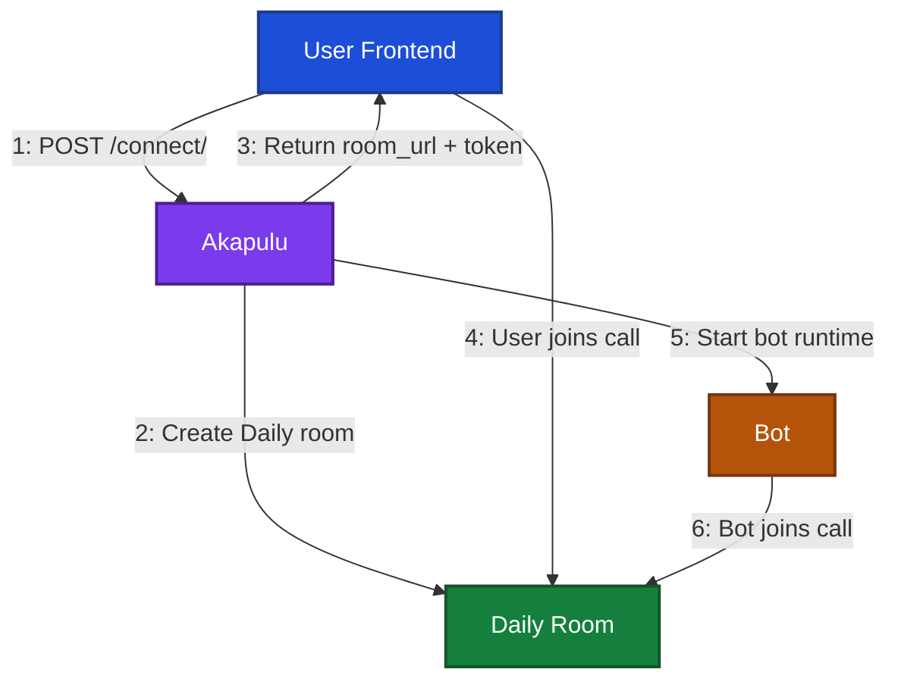

## Build your own conversation interface

In this approach, you build a custom frontend on top of Akapulu using the Pipecat + Daily stack.

Your UI talks to the realtime layer through [PipecatClient](https://docs.pipecat.ai/client/js/api-reference/client-constructor), [RTVI callbacks and events](https://docs.pipecat.ai/client/js/api-reference/callbacks), and [Daily transport](https://docs.pipecat.ai/client/js/transports/daily).

Live audio and video are carried by [Daily](https://docs.daily.co/get-started), while Pipecat/RTVI drives the app-level conversation state your interface reacts to.

We recommend this approach when you need custom branding, custom layout, custom controls, or product-specific UX around the live conversation.

For a full working implementation, start with the [Custom RTVI UI example](/examples/basic/custom-rtvi-ui).

## Using Pipecat and Daily in your custom UI

```tsx
import { PipecatClient } from "@pipecat-ai/client-js";
import { DailyTransport } from "@pipecat-ai/daily-transport";
import { PipecatClientProvider, usePipecatClient } from "@pipecat-ai/client-react";
import { DailyProvider, useDaily } from "@daily-co/daily-react";

// 1) Create one client + one transport for this page.
const transport = new DailyTransport();
const client = new PipecatClient({ transport });

export default function ConversationPage() {
  return (

    // 2) Pipecat provider exposes usePipecatClient() to child components.
    <PipecatClientProvider client={client}>

      {/* 3) Daily provider uses the same transport so both layers share one call. */}
      <DailyProvider callObject={transport.getCallObject()}>
    
        <CustomConversationUI />
      </DailyProvider>
    </PipecatClientProvider>
  );
}

function CustomConversationUI() {

  // 4) Access Pipecat client methods/events in your custom UI.
  const client = usePipecatClient();
  // 5) Access the Daily call object/state in the same component tree.
  const daily = useDaily();
  // Use `client` and `daily` in your own handlers/components from here.

}
```

## Conversation lifecycle review

Your custom UI starts by calling the Akapulu [connect endpoint](/api-reference/conversations/connect), then using the returned `room_url` and `token` to join the Daily call with Pipecat.




## Who is in the room

Each conversation room has two core participants:

- **Local user participant:** the browser user who joins from your frontend (camera/mic input and local UI controls).
- **Bot participant:** the Akapulu AI assistant that joins the same room as a remote participant


The snippet below calls the Akapulu `/conversations/connect/` API:

```ts
function CustomConversationUI() {

  async function startConversation() {
    // Akapulu /connect endpoint
    const response = await fetch("https://akapulu.com/api/conversations/connect/", {
      method: "POST",
      headers: {
        Authorization: `Bearer ${apiKey}`,
      },
      body: JSON.stringify({
        scenario_id: "your-scenario-id",
        avatar_id: "your-avatar-uuid",
      }),
    });

    // Akapulu returns room_url, token, and conversation_session_id
    const { room_url, token, conversation_session_id } = await response.json();
  }
}
```

On the Akapulu side, this request creates the Daily room and returns the `room_url` and `token` your frontend needs.

<Note>It also returns `conversation_session_id`, which you can use for updates polling and session tracking.</Note>

Then join the call from your frontend with the returned credentials:

```ts
function CustomConversationUI() {
  const client = usePipecatClient();

  async function startConversation() {
    // room_url + token come from the /connect response.
    await client.connect({
      room_url,
      token,
    });
  }
}
```

This call is where the user joins the Daily room from your frontend.  
Akapulu then continues by starting the bot runtime and having the bot join the same room.

## Render the live video call UI

After `client.connect(...)` succeeds, you can render the active call UI using the Daily layer from `useDaily()` and the [DailyVideo](https://docs.daily.co/reference/daily-react/daily-video) component.

```tsx
import { useDaily, useParticipantIds, DailyVideo } from "@daily-co/daily-react";

function CustomConversationUI() {
  const daily = useDaily();

  // Get Bot participant id
  const remoteParticipantIds = useParticipantIds({ filter: "remote" });
  const botParticipantId = remoteParticipantIds[0];

  // Get local participant Id
  const localParticipantId = daily?.participants()?.local?.session_id;

  return (
    <div>
      {/* Local participant video */}
      <DailyVideo sessionId={localParticipantId} type="video" />

      {/* Bot/remote participant video */}
      <DailyVideo sessionId={botParticipantId} type="video" />
    </div>
  );
}
```

<Note>
On macOS, [Continuity Camera](https://support.apple.com/en-us/HT213244) can be selected automatically as camera or microphone input. If the iPhone is far away or in a pocket, this can lead to a drop in speech recognition quality. If this happens, you can disconnect Continuity Camera for the session, or disable it on iPhone (**Settings > General > AirPlay & Handoff > Continuity Camera**).
</Note>

## Built-in RTVI events

Pipecat includes built-in RTVI events you can subscribe to in your UI for conversation behavior.  
For the full list and payload details, see the [RTVI callbacks and events docs](https://docs.pipecat.ai/client/js/api-reference/callbacks).

Common built-in examples:

- `RTVIEvent.UserTranscript` for user transcript updates.
- `RTVIEvent.BotTranscript` for assistant transcript updates.
- `RTVIEvent.UserStartedSpeaking` when the user begins speaking.
- `RTVIEvent.UserStoppedSpeaking` when the user stops speaking.
- `RTVIEvent.BotStartedSpeaking` when bot speech starts.
- `RTVIEvent.BotStoppedSpeaking` when bot speech ends.

## Akapulu custom ServerMessages

Akapulu also sends custom events through `RTVIEvent.ServerMessage` for product-specific UI state and tool activity.

### Flow node changed

- `message.type`: `"flow-node-changed"`
- `message.node`: current node/stage id in the conversation flow.


_Example payload:_

```json
{
  "type": "flow-node-changed",
  "node": "intro"
}
```

### Bot speaking state

- `message.type`: `"bot-speaking-state"`
- `message.state`: bot speaking state (`speaking` or `idle`).

_Example payload:_

```json
{
  "type": "bot-speaking-state",
  "state": "speaking"
}
```

### RAG tool event

- `message.type`: `"RAG"`
- `message.function_name`: RAG tool name.
- `message.body.query`: query sent to the knowledge base.

_Example payload:_

```json
{
  "type": "RAG",
  "function_name": "search_docs",
  "body": {
    "query": "How do I reset a password?"
  }
}
```

### Vision tool event

- `message.type`: `"vision"`
- `message.function_name`: vision tool name.

_Example payload:_

```json
{
  "type": "vision",
  "function_name": "analyze_camera_frame",
  "body": {}
}
```

### HTTP tool event

- `message.type`: `"http"`
- `message.function_name`: HTTP tool name.
- `message.body`: HTTP tool request body payload

<Note>
Use care with sensitive values in HTTP endpoint templates. The HTTP tool event includes the full request body payload in frontend-visible RTVI messages, so avoid placing secrets in body fields. Keep secrets in headers and follow the [Templates and Variables](/guides/endpoints/templates-and-variables) guidance.
</Note>

_Example payload:_

```json
{
  "type": "http",
  "function_name": "create_lead",
  "body": {
    "name": "Jordan Lee",
    "email": "jordan@example.com"
  }
}
```

## Subscribe to built-in and custom RTVI events

```ts
import { RTVIEvent } from "@pipecat-ai/client-js";
import { usePipecatClient } from "@pipecat-ai/client-react";

function CustomConversationUI() {
  const client = usePipecatClient();

  useEffect(() => {
    // Built-in RTVI events
    client.on(RTVIEvent.UserTranscript, (data) => {
      // TODO: handle user transcript updates
    });

    client.on(RTVIEvent.BotTranscript, (data) => {
      // TODO: handle bot transcript updates
    });

    client.on(RTVIEvent.UserStartedSpeaking, () => {
      // TODO: handle user started speaking
    });

    // Akapulu custom events via ServerMessage
    client.on(RTVIEvent.ServerMessage, (message) => {
      switch (message?.type) {
        case "flow-node-changed":
          // TODO: update current stage UI from message.node
          break;
        case "bot-speaking-state":
          // TODO: update speaking indicator from message.state
          break;
        case "RAG":
          // TODO: show tool activity from message.function_name + message.body.query
          break;
        case "vision":
          // TODO: show vision tool activity from message.function_name
          break;
        case "http":
          // TODO: show HTTP tool activity from message.function_name + message.body
          break;
        default:
          break;
      }
    });
  }, [client]);
}
```

## Build a loading display during startup

The bot and room startup process can take 10-15 seconds, so we recommend your custom UI should include a loading state before entering the live call view.

During this phase, we suggest you show users:

- a status text that reflects current setup progress
- a progress indicator (for example, a progress bar)
- a clear transition into the live UI once readiness is reached

The recommended source of truth for this state is the [conversation updates endpoint](/api-reference/conversations/updates), which returns readiness and progress fields you can map directly into your loading UX.

```ts
async function fetchConversationUpdates(conversationSessionId: string, apiKey: string) {
  const response = await fetch(
    `https://akapulu.com/api/conversations/${conversationSessionId}/updates/`,
    {
      method: "GET",
      headers: {
        Authorization: `Bearer ${apiKey}`,
      },
    },
  );

  const { call_is_ready, completion_percent, latest_update_text } = await response.json();

  return {
    // True when setup is complete and you should switch into the live call UI.
    call_is_ready,
    // Numeric progress value (from 0 to 100) you can map to a loading/progress bar.
    completion_percent,
    // Human-readable status text you can show in the loading state.
    latest_update_text,
  };
}
```


*Shown at 2x speed.*


## Recording strategy in a custom UI

After you trigger recording, there is a short initialization delay before capture actually begins. 

We recommend starting recording when loading progress reaches `completion_percent >= 50%`.

This timing is usually the best balance: early enough to capture the beginning of the live interaction, but late enough to avoid recording too much startup/idle time.


```tsx
function CustomConversationUI() {
  const daily = useDaily();
  const [recordingStarted, setRecordingStarted] = useState(false);

  useEffect(() => {

    // Start recording once loading progress reaches 50%.
    if (completionPercent >= 50 && !recordingStarted) {
      daily?.startRecording({ type: "cloud" });
      setRecordingStarted(true);
    }
  }, [completionPercent, recordingStarted, daily]);
}
```

<Note>Completed recordings are available in your Akapulu conversations page at <a href="https://akapulu.com/conversations" target="_blank" rel="noopener noreferrer">akapulu.com/recordings</a>.</Note>

## Full outline snippet

Here's a single snippet showing all the above in a single template file

```tsx
"use client";

import { useCallback, useEffect, useMemo, useRef, useState } from "react";
import {
  DailyProvider,
  DailyVideo,
  useDaily,
  useParticipantIds,
} from "@daily-co/daily-react";
import {
  PipecatClient,
  PipecatClientProvider,
  RTVIEvent,
  usePipecatClient,
} from "@pipecat-ai/client-react";
import { DailyTransport } from "@pipecat-ai/daily-transport";

type ConnectResponse = {
  // Daily room URL created by Akapulu for this conversation.
  room_url: string;
  // Daily meeting token scoped for this participant/session.
  token: string;
  // Akapulu conversation ID used for polling /updates.
  conversation_session_id: string;
};

type UpdatesResponse = {
  // True when startup is done and you can switch to live call UI.
  call_is_ready: boolean;
  // Startup progress from 0-100
  completion_percent: number;
  // Human-readable status text for loading UI.
  latest_update_text: string;
};

// NOTE: we recommend moving this to a backend route to avoid exposing API Key on frontend
async function connectConversation(apiKey: string): Promise<ConnectResponse> {
  const response = await fetch("https://akapulu.com/api/conversations/connect/", {
    method: "POST",
    headers: {
      "Content-Type": "application/json",
      Authorization: `Bearer ${apiKey}`,
    },
    body: JSON.stringify({
      // Required fields:
      scenario_id: "your-scenario-id",
      avatar_id: "your-avatar-uuid",

    }),
  });

  // /connect returns room_url + token + conversation_session_id.
  return response.json();
}

async function fetchConversationUpdates(
  conversationSessionId: string,
  apiKey: string,
): Promise<UpdatesResponse> {
  const response = await fetch(
    `https://akapulu.com/api/conversations/${conversationSessionId}/updates/`,
    {
      method: "GET",
      headers: {
        Authorization: `Bearer ${apiKey}`,
      },
    },
  );

  // /updates returns readiness, progress, and current status text.
  return response.json();
}


function CustomConversationUI({ apiKey }: { apiKey: string }) {
  // Daily call object from DailyProvider.
  const daily = useDaily();
  // Pipecat client instance from PipecatClientProvider.
  const client = usePipecatClient();

  // Core session and loading state.
  const [conversationSessionId, setConversationSessionId] = useState("");
  const [statusText, setStatusText] = useState("Starting conversation...");
  const [completionPercent, setCompletionPercent] = useState(0);
  const [callIsReady, setCallIsReady] = useState(false);
  const [isConnecting, setIsConnecting] = useState(false);
  const [recordingStarted, setRecordingStarted] = useState(false);

  // Daily participant IDs for rendering the local and bot video tiles.
  const localParticipantId = useParticipantIds({ filter: "local" })[0];
  const botParticipantId = useParticipantIds({ filter: "remote" })[0];

  const startConversation = useCallback(async () => {
    // Guard against duplicate connect attempts.
    if (!client || isConnecting) return;
    setIsConnecting(true);

    // 1) Ask Akapulu to create/prepare the conversation + Daily room.
    const { room_url, token, conversation_session_id } = await connectConversation(apiKey);
    // 2) Save conversation ID so we can poll /updates.
    setConversationSessionId(conversation_session_id);

    // 3) Join the Daily room through Pipecat transport.
    await client.connect({
      endpoint: room_url,
      token,
    });
  }, [client, apiKey, isConnecting]);

  // Kick off the connect flow once the component mounts.
  useEffect(() => {
    startConversation();
  }, [startConversation]);

  // 4) Poll setup progress every 0.5s until call_is_ready is true.
  useEffect(() => {
    if (!conversationSessionId || callIsReady) return;

    const interval = setInterval(async () => {
      const updates = await fetchConversationUpdates(conversationSessionId, apiKey);
      // Use readiness to decide when to switch from loading -> live UI.
      setCallIsReady(updates.call_is_ready);
      // Use progress for bars/percent indicators.
      setCompletionPercent(updates.completion_percent);
      // Use status text as human-friendly loading copy.
      setStatusText(updates.latest_update_text);
    }, 500);

    // Always clean up interval on unmount/dependency change.
    return () => clearInterval(interval);
  }, [conversationSessionId, apiKey, callIsReady]);

  // 5) Subscribe to built-in RTVI events for speaking/transcript UX.
  useEffect(() => {
    if (!client) return;

    const offUserStartedSpeaking = client.on(RTVIEvent.UserStartedSpeaking, () => {
      // TODO: mark local user as "speaking".
    });
    const offUserTranscript = client.on(RTVIEvent.UserTranscript, (event) => {
      // TODO: append user text from event.data.text.
    });
    const offBotTranscript = client.on(RTVIEvent.BotTranscript, (event) => {
      // TODO: append bot text from event.data.text.
    });

    // Remove listeners when client changes/unmounts.
    return () => {
      offUserStartedSpeaking?.();
      offUserTranscript?.();
      offBotTranscript?.();
    };
  }, [client]);

  // 6) Subscribe to Akapulu custom ServerMessages for product-specific UX.
  useEffect(() => {
    if (!client) return;

    const offServerMessage = client.on(RTVIEvent.ServerMessage, (event) => {
      const message = event.data;

      if (message.type === "flow-node-changed") {
        // TODO: show current flow node from message.body.current_node_name.
      } else if (message.type === "bot-speaking-state") {
        // TODO: set bot speaking indicator from message.body.is_bot_speaking.
      } else if (message.type === "RAG") {
        // TODO: surface retrieval/tool activity in UI logs.
      } else if (message.type === "vision") {
        // TODO: surface vision/tool activity in UI logs.
      } else if (message.type === "http") {
        // TODO: surface HTTP tool activity in UI logs.
      }
    });

    // Remove listener when client changes/unmounts.
    return () => {
      offServerMessage?.();
    };
  }, [client]);

  // 7) Start recording once setup is underway (>= 50%).
  useEffect(() => {
    if (completionPercent >= 50 && !recordingStarted) {
      // Daily cloud recording.
      daily?.startRecording({ type: "cloud" });
      setRecordingStarted(true);
    }
  }, [completionPercent, recordingStarted, daily]);

  // Loading view shown while Akapulu is preparing the room/session.
  if (!callIsReady) {
    return (
      <div>
        <p>{statusText}</p>
        <p>{completionPercent}%</p>
      </div>
    );
  }

  // Live call view once the session is ready.
  return (
    <div>
      {/* Local user tile */}
      <DailyVideo sessionId={localParticipantId} type="video" />
      {/* Bot tile */}
      <DailyVideo sessionId={botParticipantId} type="video" />
    </div>
  );
}

export default function Page() {
  // Create one transport instance for the page lifetime.
  const transport = useMemo(() => new DailyTransport(), []);
  // Keep one stable Pipecat client instance across renders.
  const clientRef = useRef<PipecatClient | null>(null);
  if (!clientRef.current) {
    clientRef.current = new PipecatClient({ transport });
  }

  // Provider tree: Daily + Pipecat context for all child components.
  return (
    <DailyProvider>
      <PipecatClientProvider client={clientRef.current}>
        {/* Pass API key from secure config in real apps. */}
        <CustomConversationUI />
      </PipecatClientProvider>
    </DailyProvider>
  );
}
```

<Note>For a custom engineered implementation, see our Enterprise plan at <a href="https://akapulu.com/pricing" target="_blank" rel="noopener noreferrer">akapulu.com/pricing</a>.</Note>

