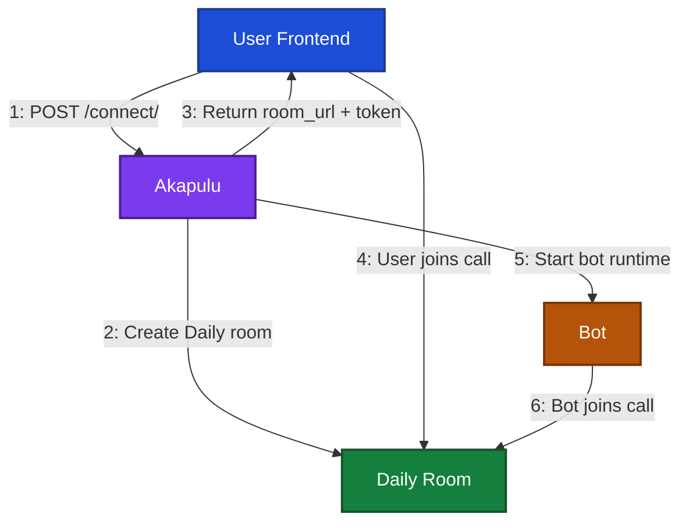

This guide covers the end-to-end conversation flow.

## Connect a Conversation Session

Akapulu uses [Daily](https://docs.daily.co/get-started) behind the scenes for live WebRTC audio and video transport.  
Your app starts a session by calling the connect endpoint, and Akapulu handles room setup, assistant startup, and session coordination.

### Connection flow diagram

### Conversation participants

Each live conversation has two core participants in the Daily room:

- **User participant**: the person joining from your frontend (microphone and optional camera).
- **Bot participant**: the Akapulu assistant runtime, which joins as the remote participant.

Your application experience is the interaction between these two participants in the same session.

### End-to-end connection flow

1. **Client calls connect**
   - Your app sends `POST /api/conversations/connect/` with:
     - `Authorization: Bearer <API_KEY>`
     - `scenario_id`
     - `avatar_id` (UUID)
     - optional `runtime_vars`
     - optional `stt_keywords`
   - `scenario_id` controls conversation behavior; `avatar_id` selects the avatar for that specific session.

2. **Session is validated and prepared**
   - API key ownership, scenario access, avatar access, and active plan limits are validated.
   - Scenario runtime configuration is prepared for the session.

3. **Daily room and credentials are created**
   - A private Daily room is created for the conversation.
   - Connection credentials are generated for the user session.

4. **Connect response is returned**
   - The connect response returns:
     - `room_url`
     - `token`
     - `conversation_session_id`

5. **User joins the room**
   - Your frontend uses `room_url` and `token` to join the Daily room.

6. **Assistant runtime starts in parallel**
   - The bot process starts for the selected scenario and avatar.

7. **Bot joins the room**
   - After initialization completes, the bot joins as the remote participant.

8. **Frontend monitors readiness**
   - Poll `GET /api/conversations/{conversation_session_id}/updates/` until `call_is_ready` is `true`.
   - Once ready, transition your UI from loading state to live in-call state.

### Pre-join timeout behavior

If no user participant joins the Daily room shortly after connect(45 seconds), Akapulu automatically ends the session to avoid leaving an abandoned bot process running.

## Understand Usage and Concurrency Limits

Conversation capacity is controlled by your current [plan](https://akapulu.com/pricing). Before a session starts, Akapulu validates usage and concurrency limits for the API key owner.

### How plan limits are applied

- **Concurrency limit**: each active conversation uses **one** concurrency slot.
- **Max concurrency**: total available slots come from your plan.
- **Minutes limit**: total monthly minutes available come from your plan.
- **Per-call duration cap**: each session is capped by the lower of:
  - your plan's max call duration
  - your remaining minutes

### Concurrency behavior

When `POST /api/conversations/connect/` succeeds, the new conversation reserves one active slot. If no slots are available, connect is rejected until another active conversation ends or expires.

### Minutes usage behavior

Minutes used increase while the conversation is ongoing and are tracked in whole minutes.

You can view total minutes used, current concurrency slots used, and your next plan reset date on the [Usage](https://akapulu.com/usage) page.

## Manage Recordings and Transcripts

You can view conversation sessions on the [Conversations](https://akapulu.com/conversations) page.

For each session, you can:

- open the transcript view, which shows a sanitized transcript that excludes full tool call messages
- click **Download Recording** to download and review the recording
