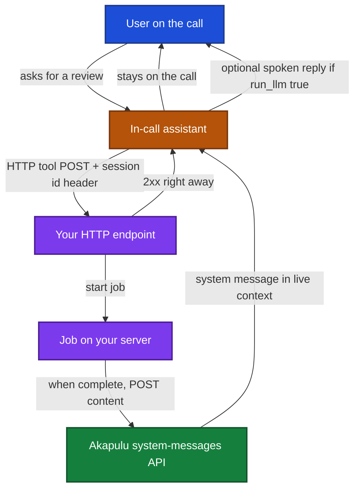

Use this for any long-running work you do not want to block the live call on, including calling a reasoning model. When that work finishes, post the result back into the same session as a **system message**.

The assistant then has the new facts without the user repeating them, and without you blocking the in-call tool.

## What a system message does

`POST /api/conversations/{conversation_session_id}/system-messages/` appends exactly one message to the live LLM context:

```json
{ "role": "system", "content": "<your content>" }
```

- It is **not** spoken.
- It is **not** treated as a user turn.
- Do not wrap it in extra JSON or role labels. Send the text you want the model to see.

`run_llm` controls what happens next:

| `run_llm` | Effect |
| --- | --- |
| `false` (default) | Append only. The next LLM run (usually the next user turn) sees the new context. |
| `true` | Append, then run the LLM so the assistant can reply now. |

Full request shape: [Post a system message](/api-reference/conversations/system-messages).

## How you get the session id

You need the session UUID on your server. Typical sources:

- `conversation_session_id` from [connect](/api-reference/conversations/connect)
- **`X-Akapulu-Conversation-Session-Id`** on every HTTP tool POST (live and Testing Mode). You cannot put the id in the endpoint template ahead of time. See [Endpoints](/guides/endpoints/create-endpoint).

Call the system-messages route from **your backend** with `Authorization: Bearer <YOUR_AKAPULU_API_KEY>`. Do not put the API key in the browser.

## Workflow

HTTP tools on Akapulu **return immediately**. They are not a place to wait on a slow job.

A pattern that works:

1. The in-call assistant calls an HTTP tool (for example “review this chart”).
2. Your endpoint records the session id from `X-Akapulu-Conversation-Session-Id`, starts the job, and **returns a 2xx quickly**.
3. Your server does the work.
4. When it finishes, POST a system message into that session with the result.



### When to set `run_llm`

- **`false`**: the user is still talking, or you only want the facts available if they ask. Example: “Prior auth notes are in. Last A1C was 7.2.”
- **`true`**: the user is waiting for that result and the assistant should speak now. Example: “Chart review is done. Tell the patient the A1C in one short sentence.”

## Example

Your tool handler starts work and returns:

```json
{ "status": "started", "message": "I am reviewing the chart now." }
```

When the job completes:

```python
import os
import requests

session_id = os.environ["CONVERSATION_SESSION_ID"]  # from X-Akapulu-Conversation-Session-Id
requests.post(
    f"https://akapulu.com/api/conversations/{session_id}/system-messages/",
    json={
        "content": (
            "Chart review complete. Last A1C was 7.2 on 2026-03-01. No new allergies. "
            "If the patient asks about labs, share the A1C in one sentence."
        ),
        "run_llm": True,
    },
    headers={
        "Authorization": f"Bearer {os.environ['AKAPULU_API_KEY']}",
        "Content-Type": "application/json",
    },
    timeout=30,
)
```

Same call with curl:

```bash
curl -X POST "https://akapulu.com/api/conversations/${CONVERSATION_SESSION_ID}/system-messages/" \
  -H "Authorization: Bearer <YOUR_AKAPULU_API_KEY>" \
  -H "Content-Type: application/json" \
  -d '{
    "content": "Chart review complete. Last A1C was 7.2 on 2026-03-01. No new allergies. If the patient asks about labs, share the A1C in one sentence.",
    "run_llm": true
  }'
```

The assistant can then speak from those facts. You did not block the live call while the job ran.

## Limits and ownership

- `content` must be a non-empty string, at most **16,000** characters.
- `run_llm` must be a boolean if you send it.
- The session must exist and be owned by the API key. Otherwise the API returns `SESSION_NOT_FOUND`.
- The same route works for [Testing Mode](/guides/scenarios/llm-test-mode) session ids.

<Note>
Keep HTTP tools short. If your endpoint waits minutes for a job, the live tool call sits open and the conversation feels stuck. Return quickly, then update context when the job is done.
</Note>
