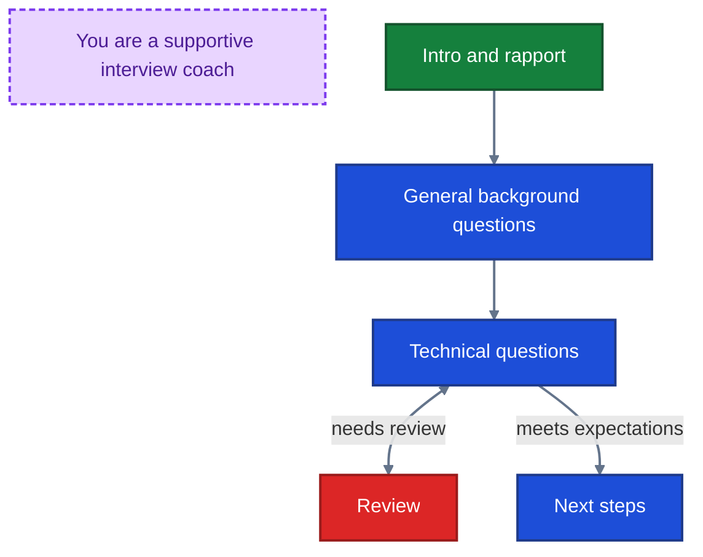
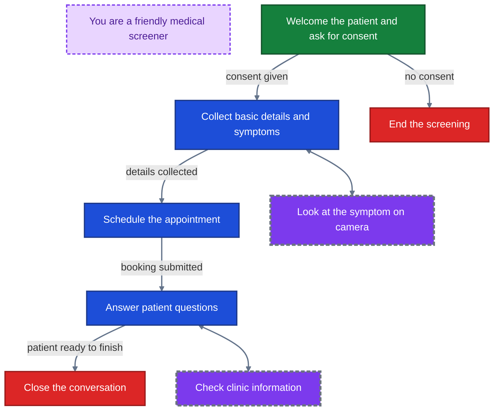
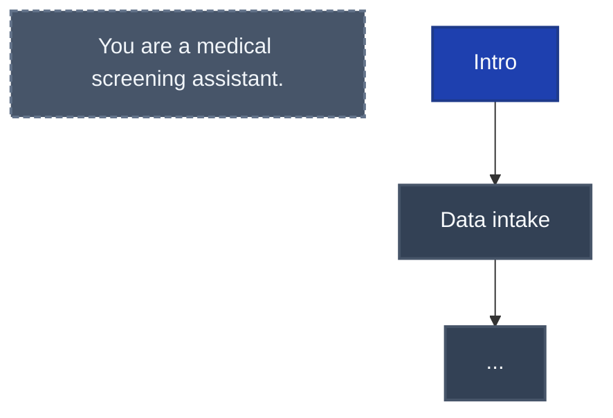
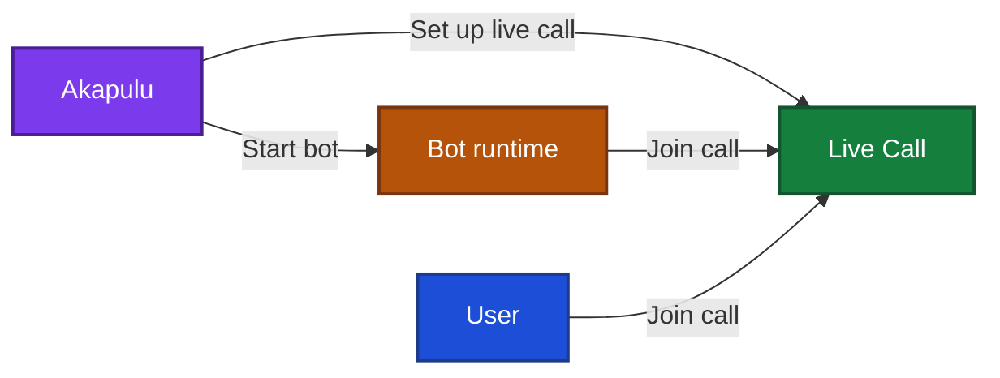

## What Akapulu is

- Akapulu is a platform for building real-time conversational video and voice experiences.
- It helps you launch AI assistants (bots) that join live calls with users: the user speaks naturally, and the bot listens, responds in real time, and follows your configured instructions and tools.


## Akapulu architecture

Akapulu runs each conversation through a real-time pipeline of linked stages: it receives user audio (and optionally video) input, generates the bot's spoken response, and streams synchronized audio and avatar video frames back to the user.

Each stage in that pipeline has a specific role, described below.

- **User media input:** receives the user's microphone audio and optional camera video from the call.
- **STT (speech-to-text):** converts the user's spoken audio into text the LLM can process.
- **LLM (reasoning layer):** reads the transcribed user input plus your instructions, then decides what to say and which tools to call.
- **TTS (text-to-speech):** turns the LLM's text response into spoken audio for the bot.
- **Avatar rendering/animation:** synchronizes the avatar's face and mouth movement to the generated speech so the response is delivered as a talking avatar.
- **Avatar media output:** streams the bot's synthesized audio and rendered avatar video frames back to the user in real time.

### Akapulu conversation pipeline


## Controlling bot behavior

The content of the bot's response is determined in the LLM section of the pipeline. This is where you control behavior through both global role prompts (for the avatar's overall persona, tone, and guardrails) and node-level instructions (for what to do in each stage), plus the tools the bot can call.

In Akapulu, you apply that behavior by launching each conversation with a [scenario](/guides/scenarios/overview). The scenario provides the global role context, node-specific instructions, tool access, and flow that the LLM uses during the conversation.

## Scenarios and conversation stages

For most real conversations, a single static prompt does not provide enough control. The assistant often needs different guidance and tools at different moments in the conversation, and the ability to take certain actions according to predefined criteria.

A scenario lets you design that flow as a set of stages. At each stage, you can decide:

- what the assistant should focus on right now
- how it should respond
- which tools it can use at that point

As well as a global role prompt that applies across the full conversation

As the conversation evolves, the assistant can move from stage to stage when appropriate. This keeps behavior focused and predictable.

For example:

- **Interview Training Avatar:** intro and rapport -> general background questions -> technical questions -> next steps

 *Example guidance for the LLM*


- **Patient Intake Screening:** intro -> data intake -> appointment booking -> Q&A -> end

*Example guidance for the LLM*



## Nodes

Akapulu implements these stages using [nodes](/guides/scenarios/node-basics). A node has custom instructions for the LLM and the specific tools connected to that node.

The bot (LLM) can choose to transition to different nodes through tool calls.


Akapulu provides an easy-to-understand drag-and-drop UI for building and connecting nodes.


## Using Akapulu

1. Create a scenario for your desired use case, including both a global role prompt and node-level stage instructions.

> *example id:* `scenario_1234`



2. Then, to start a conversation, call the [`/connect`](/api-reference/conversations/connect) endpoint and pass **`scenario_id`** (which flow and instructions the bot follows) and **`avatar_id`** (which trained avatar performs the conversation). 

Example JSON request body:

```json
{
  "scenario_id": "scenario_1234",
  "avatar_id": "avatar_5678"
}
```

Akapulu then sets up the live call, starts the bot, and has the bot join the call.

3. The user then joins the same call, and you're ready to go!





During the call, the llm is prompted according to the given scenario.


## Next steps

- Learn more about [Scenarios](/guides/scenarios/overview) to design node flows and behavior.
- Learn how to [customize the conversation UI](/guides/conversations/customize-conversation-ui) in your frontend.
- Browse [Examples](/examples/index) for end-to-end reference implementations.

