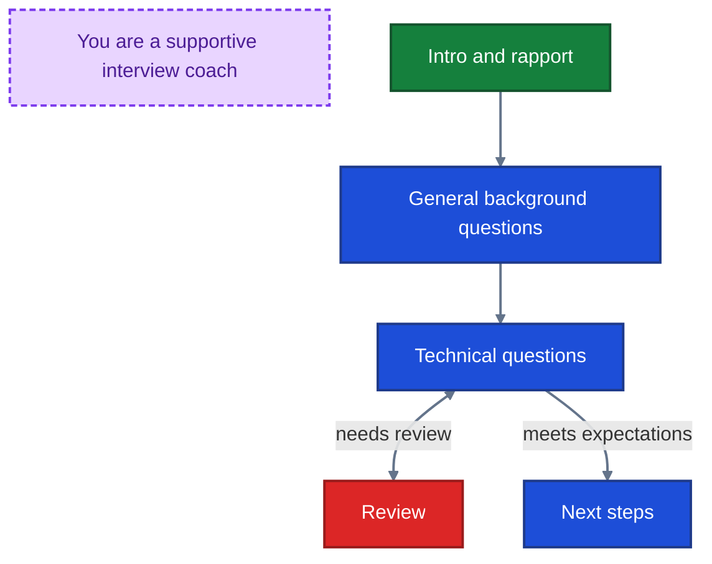
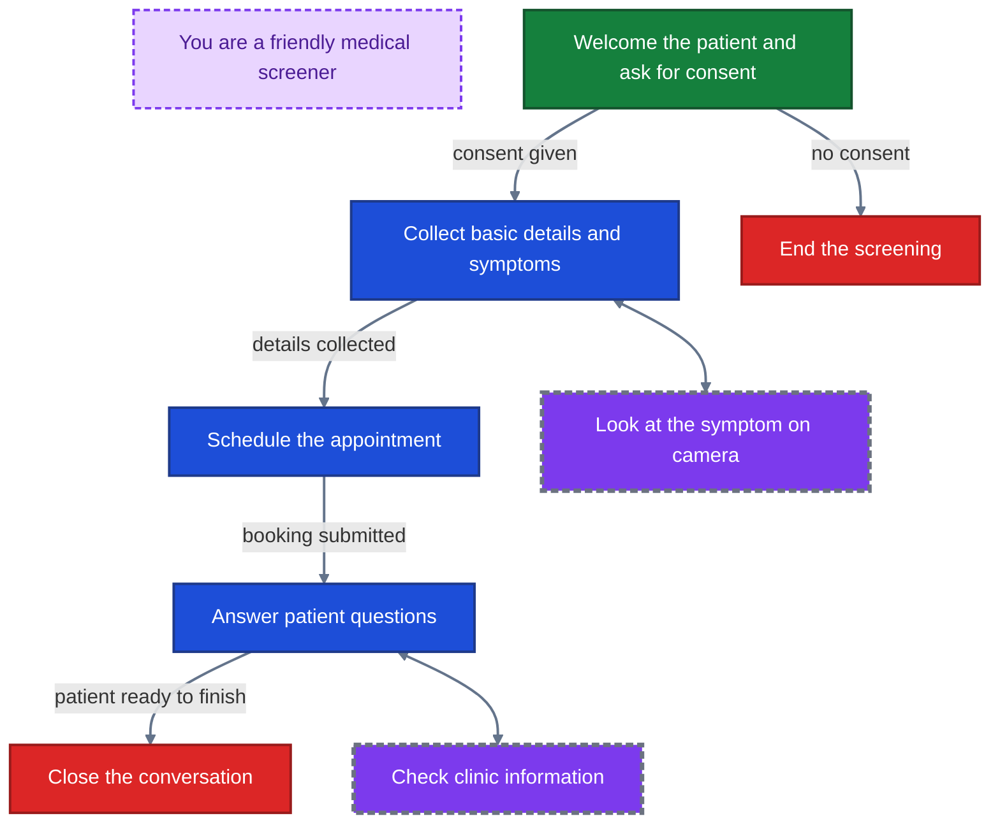

Scenarios are how you control assistant behavior in Akapulu.

When you start a conversation, the scenario provides:

- a global `role_instruction`
- node-specific `task_instruction` prompts
- tool access (transitions, HTTP tools, RAG, vision)
- flow logic for how the conversation moves between stages

For most real conversations, a single static prompt is not enough. The assistant often needs different instructions and tools at different moments.

## Scenarios and conversation stages

A scenario lets you design the flow as a set of stages. At each stage, you can decide:

- what the assistant should focus on
- how it should respond
- which tools it can use

As the conversation evolves, the assistant transitions between stages when appropriate.

For example:

- **Interview Training Avatar:** intro and rapport -> general background questions -> technical questions -> next steps

*Example guidance for the LLM*


- **Patient Intake Screening:** intro -> data intake -> appointment booking -> Q&A -> end

*Example guidance for the LLM*


## Nodes

Akapulu implements these stages using [nodes](/guides/scenarios/node-basics). A node contains stage instructions plus the tools the assistant can use in that stage.

The model can move between nodes using transition tools.


Akapulu provides a drag-and-drop UI for building and connecting nodes.


## Role instruction, task instruction, and context management

Akapulu builds LLM context as the conversation progresses:

1. It starts with the scenario's global **`role_instruction`**.
2. It appends the current node's **`task_instruction`**.
3. It appends each **user** and **assistant** turn.
4. On node transition, it appends the new node's **`task_instruction`**.

We recommend defining your overall assistant persona in **`role_instruction`**, then using each node's **`task_instruction`** for node-specific behavior.

## Create scenario walkthrough

### Create a simple node

1. Go to the [Scenarios page](https://akapulu.com/scenarios).
2. Click **New**.
3. Enter the scenario name.
4. Open the hamburger icon in the left-side nav, then edit the global **role instruction** in the text area.
   - Example: `You are an onboarding assistant for Akapulu. Keep responses concise because they will be converted to audio.`
5. Click **Add Node** to create your first node.
6. Enter a node name (for example, `Greeting`).
7. Add a node **task instruction**.
   - Example: `Greet the user, ask what they want to build, and keep your response concise.`

<Note>
The first node you create is the default **start node**. Each scenario has exactly **one** start node.
</Note>

## Edit an existing scenario

### Add another node

1. Click **Add Node**.
2. Enter a node name:
   - `Planning Phase`
3. Add a task instruction:

```text
Help the user plan their project on the Akapulu platform

Use your Akapulu RAG tool to get information on how Akapulu works
```

## Add tools and transitions

### Add a RAG tool and a transition function

You can add tools directly to each node.

1. Create a **[Knowledge Base](/guides/knowledge-bases/overview)**.
2. Open the node you want to update.
3. Click **+ Add function** at the bottom of the node.
4. In the pop up modal, open the **RAG Tool** tab.
5. Select your desired knowledge base, then create the RAG function with:
   - **Name:** `Akapulu_RAG`
   - **Description:** `Access information on the Akapulu platform`
6. In the `Greeting` node, click **+ Add function**.
7. In the pop up modal, open the **Transition Tool** tab.
8. Create a transition function with:
   - **Name:** `transition_to_planning_phase`
   - **Description:** `Once you have gathered enough information on what the user wants to build with Akapulu, use this tool to transition to the planning phase`
9. Drag the probe on the right side of `transition_to_planning_phase` to the `Planning Phase` node to set the transition target.

## Completed scenario example

You have now built a simple scenario.

This scenario starts in `Greeting`, where the assistant asks open-ended questions about what the user wants to build with Akapulu. Once project scope is clear, it calls `transition_to_planning_phase` and moves into `Planning Phase`, where `Akapulu_RAG` is available to pull platform information and help shape the user’s plan.

If you want to view or edit this scenario as JSON, use the scenario editor toggle in the top-right corner to switch between visual mode and JSON mode.

```json
{
  "initial_node": "Greeting",
  "role_instruction": "You are a helpful Akapulu onboarding assistant. Keep responses concise because they will be converted to audio.",
  "nodes": {
    "Greeting": {
      "task_instruction": "Ask open-ended questions to understand what the user wants to build with Akapulu. Once project scope is clear, use the transition tool to move to planning.",
      "functions": [
        {
          "name": "transition_to_planning_phase",
          "description": "Once you have gathered enough information on what the user wants to build with Akapulu, use this tool to transition to the planning phase",
          "type": "transition",
          "transition_to": "Planning Phase"
        }
      ]
    },
    "Planning Phase": {
      "task_instruction": "Help the user plan their project on the Akapulu platform. Use the knowledge base tool when you need platform information.",
      "functions": [
        {
          "name": "Akapulu_RAG",
          "description": "Access information on the Akapulu platform",
          "type": "rag",
          "knowledge_base_id": "<KNOWLEDGE_BASE_ID>"
        }
      ]
    }
  }
}
```

## Next scenario guides

- [Using JSON](/guides/scenarios/using-json)
- [Node basics](/guides/scenarios/node-basics)