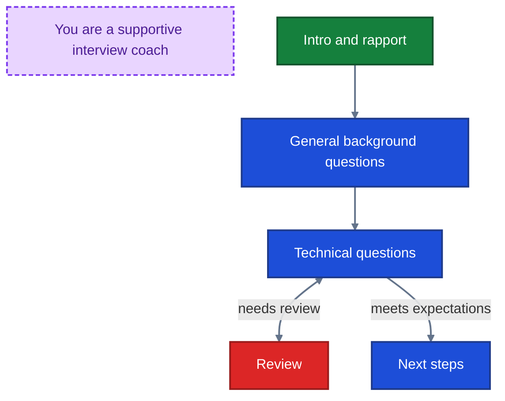
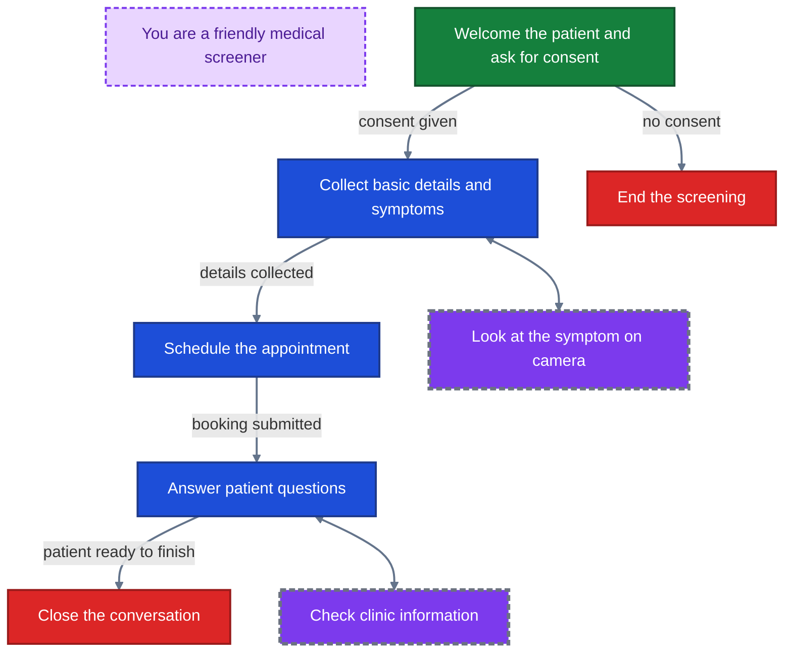

Scenarios are how you control assistant behavior in Akapulu.

When you start a conversation, the scenario provides:

- global role context
- node-specific stage instructions
- tool access (transitions, HTTP tools, RAG, vision)
- flow logic for how the conversation moves between stages

For most real conversations, a single static prompt is not enough. The assistant often needs different instructions and tools at different moments.

## Scenarios and conversation stages

A scenario lets you design the flow as a set of stages. At each stage, you can decide:

- what the assistant should focus on
- how it should respond
- which tools it can use

As the conversation evolves, the assistant transitions between stages when appropriate.

For example:

- **Interview Training Avatar:** intro and rapport -> general background questions -> technical questions -> next steps

*Example guidance for the LLM*


- **Patient Intake Screening:** intro -> data intake -> appointment booking -> Q&A -> end

*Example guidance for the LLM*


## Nodes

Akapulu implements these stages using [nodes](/guides/scenarios/node-basics). A node contains stage instructions plus the tools the assistant can use in that stage.

The model can move between nodes using transition tools.


Akapulu provides a drag-and-drop UI for building and connecting nodes.


## Role messages, task messages, and context management

When a conversation starts, Akapulu begins from the node labeled **start node**.
You can change the start node in the UI by opening the node menu (three dots in the upper-right corner of the node) and clicking **Set as Start**.

Akapulu then builds LLM context in this order:

1. The start node's **role message** is appended first.
2. The start node's **task message** is appended next.
3. Any **tool call context** is appended as tools are invoked.

When the LLM transitions to a new node, that node's **role message** (if set) and **task message** are appended to context so the assistant can continue with the correct stage instructions.

We recommend defining your overall LLM persona in the **role message** of the **start node**, then using **task messages** in each individual node to define stage-specific behavior.

## Create scenario walkthrough

### Create a simple node

1. Go to the [Scenarios page](https://akapulu.com/scenarios).
2. Click **New**.
3. Click **Add Node** to create your first node.
4. Enter a node name (for example, `Greeting`).
5. Add a **role message**.
   - Example: `You are an onboarding assistant for Akapulu.`
6. Add a **task message**.
   - Example: `Greet the user, ask what they want to build, and keep your response concise.`

<Note>
The first node you create is the default **start node**. Each scenario has exactly **one** start node.
</Note>

For a full beginner flow, see the [Simple Assistant example](/examples/basic/simple-assistant).


*Shown at 1.5x speed.*

## Edit an existing scenario

### Add another node

1. Go to the [Scenarios](https://akapulu.com/scenarios) table.
2. Click your target scenario.
3. Click **Edit** in the bottom-left corner to enter edit mode.
4. Click **Add Node**.
5. Enter a node name:
   - `Planning Phase`
6. Add a task message:

```text
Help the user plan their project on the Akapulu platform

Use your Akapulu RAG tool to get information on how Akapulu works
```


*Shown at 1.5x speed.*

## Add tools and transitions

### Add a RAG tool and a transition function

You can add tools directly to each node.

1. Create a **[Knowledge Base](/guides/knowledge-bases/overview)**.
2. Open the node you want to update.
3. Click **+ Add function** at the bottom of the node.


4. In the pop up modal, open the **RAG Tool** tab.


<Note>
Throughout the Akapulu platform and docs, the terms **corpus** and **knowledge base** are used interchangeably.
</Note>

5. Select your desired knowledge base, then create the RAG function with:
   - **Name:** `Akapulu_RAG`
   - **Description:** `Access information on the Akapulu platform`
6. In the `Greeting` node, click **+ Add function**.
7. In the pop up modal, open the **Transition Tool** tab.


8. Create a transition function with:
   - **Name:** `transition_to_planning_phase`
   - **Description:** `Once you have gathered enough information on what the user wants to build with Akapulu, use this tool to transition to the planning phase`
9. Drag the probe on the right side of `transition_to_planning_phase` to the `Planning Phase` node to set the transition target.


See gif below


*Shown at 1.5x speed.*

## Completed scenario example

You have now built a simple scenario.


This scenario starts in `Greeting`, where the assistant asks open-ended questions about what the user wants to build with Akapulu. Once project scope is clear, it calls `transition_to_planning_phase` and moves into `Planning Phase`, where `Akapulu_RAG` is available to pull platform information and help shape the user’s plan.

## Next scenario guides

- [Using JSON](/guides/scenarios/using-json)
- [Node basics](/guides/scenarios/node-basics)
- [Node structure](/guides/scenarios/node-structure)
- [Role and task messages](/guides/scenarios/role-task-messages)
- [Tools overview](/guides/scenarios/tools)