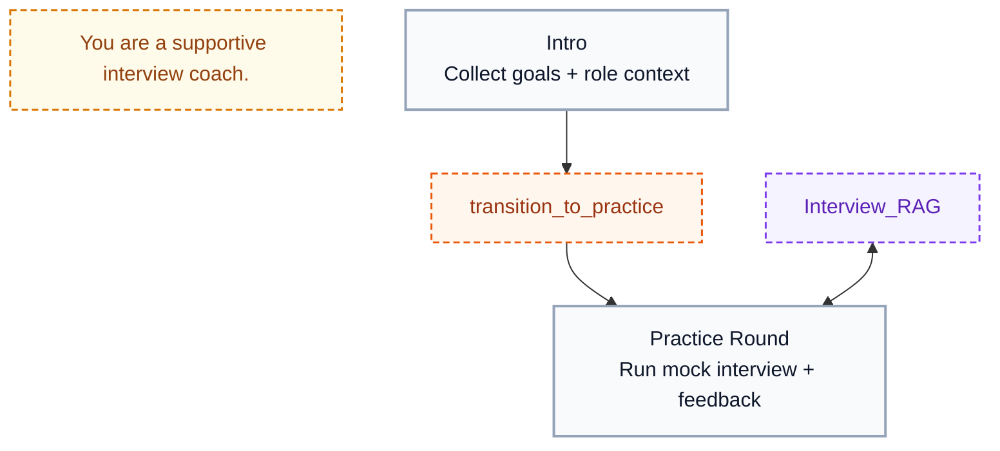
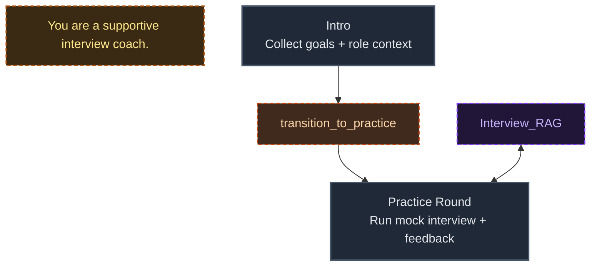
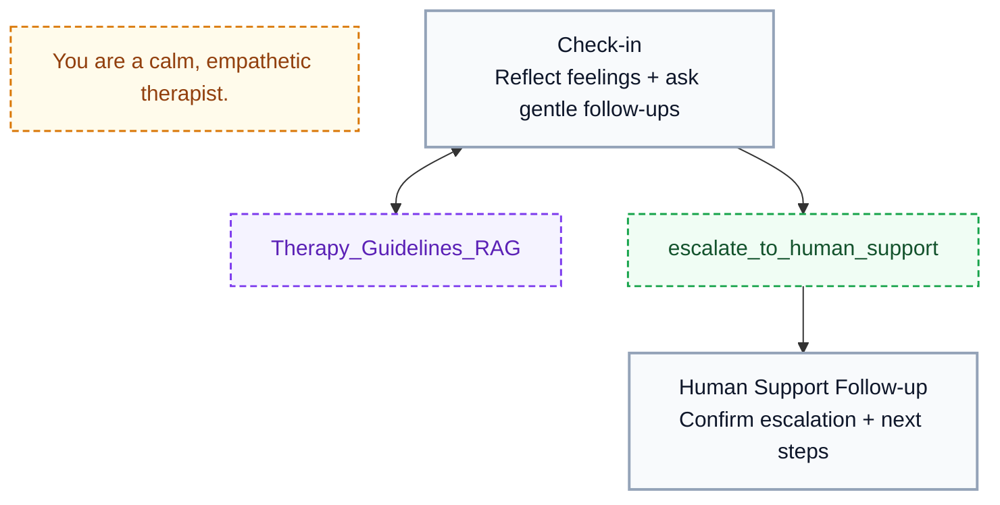
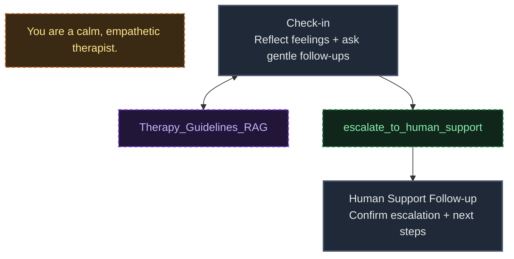
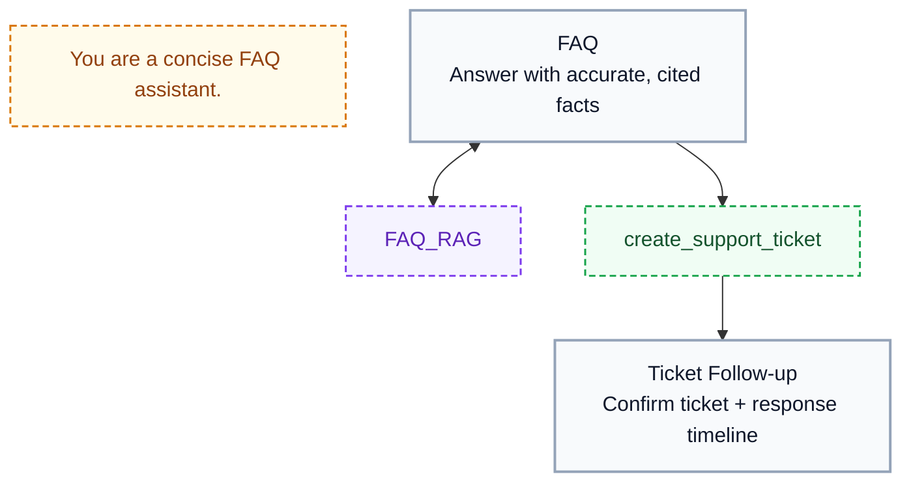
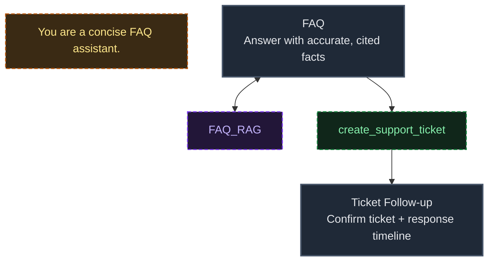
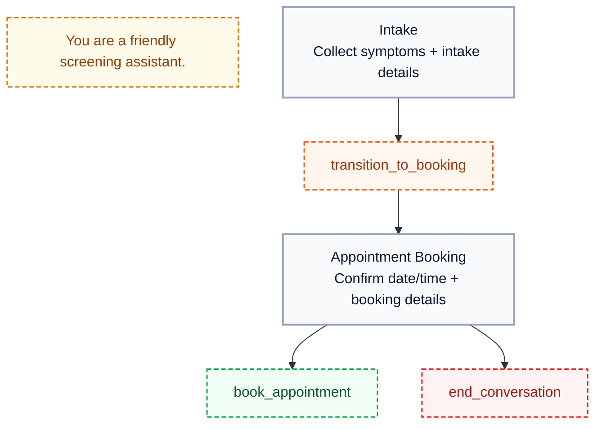
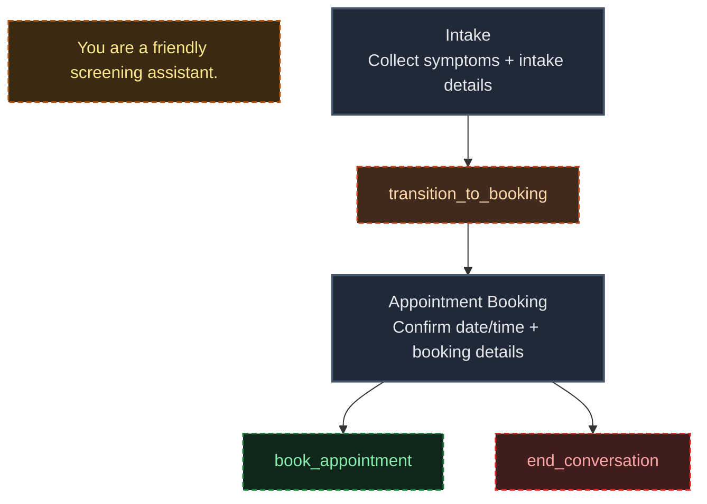

Use this guide when you want to create or edit a scenario directly in JSON.


*Use the toggle to switch between node-based edit mode and the JSON editor (shown at 2x speed).*

## JSON shape

Every scenario JSON must include:

- `initial_node`: the name of the start node
- `nodes`: an object keyed by node name

```json
{
  "initial_node": "Greeting",
  "nodes": {
    "Greeting": {
      "role_messages": [{ "role": "system", "content": "You are an onboarding assistant for Akapulu." }],
      "task_messages": [{ "role": "system", "content": "Greet the user and ask what they want to build." }],
      "pre_actions": [],
      "post_actions": [],
      "functions": [],
      "respond_immediately": true
    }
  }
}
```

## Node fields

Each node can include:

- `role_messages` (optional): role/persona instructions
- `task_messages` (required): stage instructions for the node
- `pre_actions` (optional): execute when entering the node, before response generation
- `post_actions` (optional): execute after the bot finishes its first utterance in that node
- `functions` (optional): tools available in this node
- `respond_immediately` (optional boolean): whether the assistant responds immediately after entering node

Allowed action types in `pre_actions` and `post_actions`:

- `http`
- `end_conversation`

## Function shape

Functions are defined under a node's `functions` list:

```json
{
  "function": {
    "name": "transition_to_planning_phase",
    "description": "Use this tool when project scope is clear.",
    "type": "transition",
    "transition_to": "Planning Phase"
  }
}
```

Allowed function `type` values:

- `transition`
- `http`
- `rag`
- `vision`

## Function type schemas

### `transition`

- `name`: unique function name in the node.
- `description`: when the assistant should call this function.
- `type`: must be `transition`.
- `transition_to`: target node name to move to.

Example:

```json
{
  "function": {
    "name": "transition_to_planning_phase",
    "description": "Use this tool when project scope is clear.",
    "type": "transition",
    "transition_to": "Planning Phase"
  }
}
```

### `http`

- `name`: unique function name in the node.
- `description`: what the endpoint does and when to call it.
- `type`: must be `http`.
- `endpoint_id`: ID of a saved HTTP endpoint in your account.

Example:

```json
{
  "function": {
    "name": "book_appointment",
    "description": "Create an appointment using the saved endpoint.",
    "type": "http",
    "endpoint_id": "<HTTP_ENDPOINT_ID>"
  }
}
```

### `rag`

- `name`: unique function name in the node.
- `description`: what knowledge this tool retrieves.
- `type`: must be `rag`.
- `corpus_id`: knowledge base (corpus) ID to query.

Example:

```json
{
  "function": {
    "name": "Akapulu_RAG",
    "description": "Access information on the Akapulu platform.",
    "type": "rag",
    "corpus_id": "<KNOWLEDGE_BASE_ID>"
  }
}
```

### `vision`

- `name`: unique function name in the node.
- `description`: when the assistant should inspect user video/screen context.
- `type`: must be `vision`.

Example:

```json
{
  "function": {
    "name": "inspect_user_screen",
    "description": "Use this tool when you need to inspect what the user is showing.",
    "type": "vision"
  }
}
```

`transition_to` is optional for non-transition tools. If set, it must point to an existing node name.

## Action type schemas

Actions can be used in both `pre_actions` and `post_actions`.

### `http`

```json
{
  "type": "http",
  "endpoint_id": "<HTTP_ENDPOINT_ID>"
}
```

### `end_conversation`

```json
{
  "type": "end_conversation"
}
```

## Validation rules

### Core structure

- `nodes_json` max size is `20000` characters.
- `nodes` must be a non-empty object.
- `initial_node` is required and must match an existing node name.
- Every node must include at least one non-empty `task_messages` entry.
- `respond_immediately`, if provided, must be a boolean.

### Message rules

- `task_messages[*].content` max length: `4000` characters.
- `role_messages[*].content` max length: `4000` characters.
- `task_messages` and `role_messages` cannot use `secret` or `llm` template variables.

### Function rules

- `functions` must be a list of wrappers: `{ "function": { ... } }`.
- `function.name` is required, must be unique per node, and only allows letters, numbers, `_`, `-`.
- `function.name` cannot include leading/trailing whitespace.
- `function.description` is required.
- `function.type` must be one of `transition`, `http`, `rag`, `vision` (defaults to `transition` if omitted).
- `transition` functions must define `transition_to`.
- If `transition_to` is set, it must target an existing node.
- `http` functions must define `endpoint_id` (existing endpoint).
- `rag` functions must define `corpus_id` (existing knowledge base).

### Action rules

- `pre_actions` and `post_actions` must be lists.
- Allowed action types: `http`, `end_conversation`.
- `http` actions must define `endpoint_id` (existing endpoint).

### HTTP template rules

- Endpoint `headers` and `body` must be JSON objects with string values.
- Secret variables are not allowed in endpoint body templates (put secrets in headers).
- Action endpoint templates cannot use `llm` variables.

### Editor guardrails

- Duplicate function names in the same node are blocked.
- Duplicate HTTP actions in one list are blocked.
- Duplicate `end_conversation` actions in one list are blocked.
- The initial node cannot be deleted.

## Example scenarios

Replace placeholder IDs like `<KNOWLEDGE_BASE_ID>` and `<HTTP_ENDPOINT_ID>` with values from your Akapulu account.

### 1) Interview coach

<div className="block dark:hidden">



</div>

<div className="hidden dark:block">



</div>

```json
{
  "initial_node": "Intro",
  "nodes": {
    "Intro": {
      "role_messages": [
        { "role": "system", "content": "You are a supportive interview coach." }
      ],
      "task_messages": [
        { "role": "system", "content": "Build rapport, ask the target role, and collect interview goals." }
      ],
      "functions": [
        {
          "function": {
            "name": "transition_to_practice",
            "description": "Use when goals and role context are clear.",
            "type": "transition",
            "transition_to": "Practice Round"
          }
        }
      ],
      "respond_immediately": true
    },
    "Practice Round": {
      "task_messages": [
        { "role": "system", "content": "Run mock interview questions and provide concise coaching feedback." }
      ],
      "functions": [
        {
          "function": {
            "name": "Interview_RAG",
            "description": "Retrieve interview prep guidance and role-specific best practices.",
            "type": "rag",
            "corpus_id": "<KNOWLEDGE_BASE_ID>"
          }
        }
      ],
      "respond_immediately": true
    }
  }
}
```

### 2) AI therapist (support + escalation)

<div className="block dark:hidden">



</div>

<div className="hidden dark:block">



</div>

```json
{
  "initial_node": "Check-in",
  "nodes": {
    "Check-in": {
      "role_messages": [
        { "role": "system", "content": "You are a calm, empathetic AI therapist for supportive conversation." }
      ],
      "task_messages": [
        { "role": "system", "content": "Check in emotionally, reflect feelings, and ask gentle follow-up questions." }
      ],
      "functions": [
        {
          "function": {
            "name": "Therapy_Guidelines_RAG",
            "description": "Retrieve grounding and coping guidance from approved therapeutic content.",
            "type": "rag",
            "corpus_id": "<KNOWLEDGE_BASE_ID>"
          }
        },
        {
          "function": {
            "name": "escalate_to_human_support",
            "description": "Escalate to a human support workflow when risk signals are present.",
            "type": "http",
            "endpoint_id": "<HTTP_ENDPOINT_ID>",
            "transition_to": "Human Support Follow-up"
          }
        }
      ],
      "respond_immediately": true
    },
    "Human Support Follow-up": {
      "task_messages": [
        { "role": "system", "content": "Confirm escalation status and communicate clear next steps." }
      ],
      "functions": [],
      "respond_immediately": true
    }
  }
}
```

### 3) FAQ agent

<div className="block dark:hidden">



</div>

<div className="hidden dark:block">



</div>

```json
{
  "initial_node": "FAQ",
  "nodes": {
    "FAQ": {
      "role_messages": [
        { "role": "system", "content": "You are a concise FAQ assistant." }
      ],
      "task_messages": [
        { "role": "system", "content": "Answer product and policy questions with accurate, cited facts." }
      ],
      "functions": [
        {
          "function": {
            "name": "FAQ_RAG",
            "description": "Search the FAQ knowledge base for accurate answers.",
            "type": "rag",
            "corpus_id": "<KNOWLEDGE_BASE_ID>"
          }
        },
        {
          "function": {
            "name": "create_support_ticket",
            "description": "Create a support ticket when the answer is not available in the FAQ content.",
            "type": "http",
            "endpoint_id": "<HTTP_ENDPOINT_ID>",
            "transition_to": "Ticket Follow-up"
          }
        }
      ],
      "respond_immediately": true
    },
    "Ticket Follow-up": {
      "task_messages": [
        { "role": "system", "content": "Share ticket confirmation details and expected response timing." }
      ],
      "functions": [],
      "respond_immediately": true
    }
  }
}
```

### 4) Patient screening + appointment booking

<div className="block dark:hidden">



</div>

<div className="hidden dark:block">



</div>

```json
{
  "initial_node": "Intake",
  "nodes": {
    "Intake": {
      "role_messages": [
        { "role": "system", "content": "You are a friendly patient screening assistant." }
      ],
      "task_messages": [
        { "role": "system", "content": "Collect symptoms and basic screening details." }
      ],
      "functions": [
        {
          "function": {
            "name": "transition_to_booking",
            "description": "Use when intake details are complete.",
            "type": "transition",
            "transition_to": "Appointment Booking"
          }
        }
      ],
      "respond_immediately": true
    },
    "Appointment Booking": {
      "task_messages": [
        { "role": "system", "content": "Book the appointment and confirm date/time details." }
      ],
      "functions": [
        {
          "function": {
            "name": "book_appointment",
            "description": "Submit appointment details to scheduling backend.",
            "type": "http",
            "endpoint_id": "<HTTP_ENDPOINT_ID>"
          }
        }
      ],
      "post_actions": [
        { "type": "end_conversation" }
      ],
      "respond_immediately": true
    }
  }
}
```
