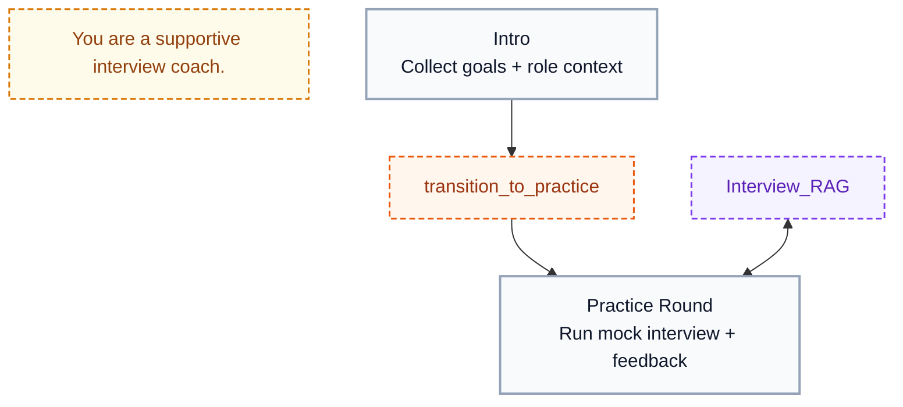
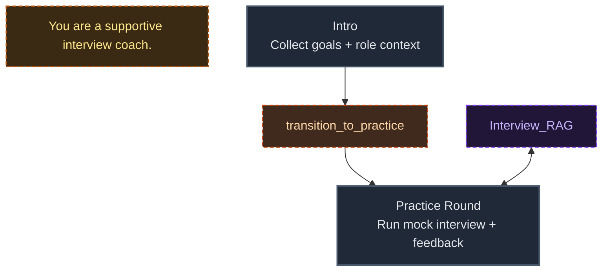
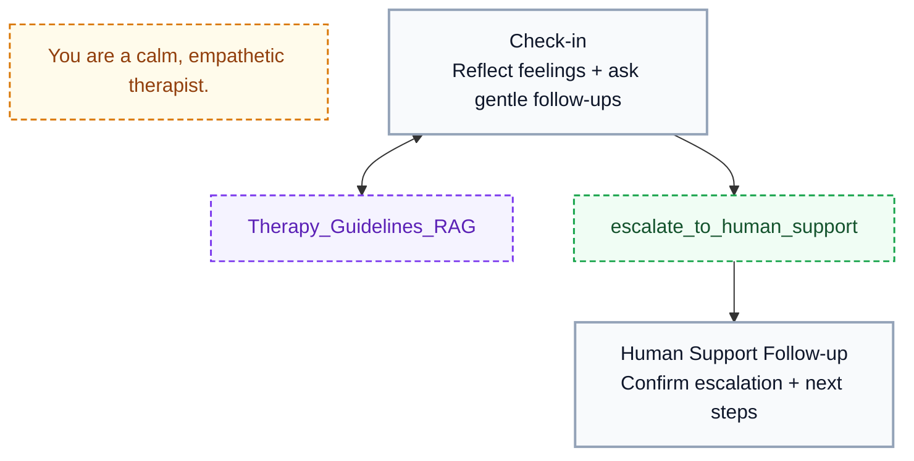
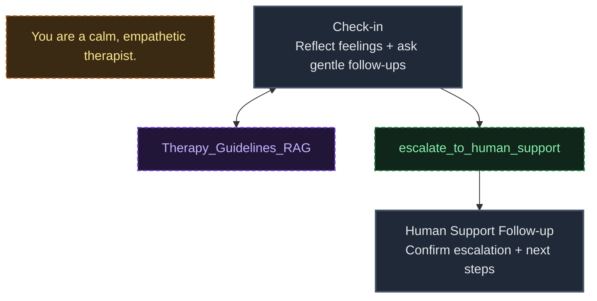
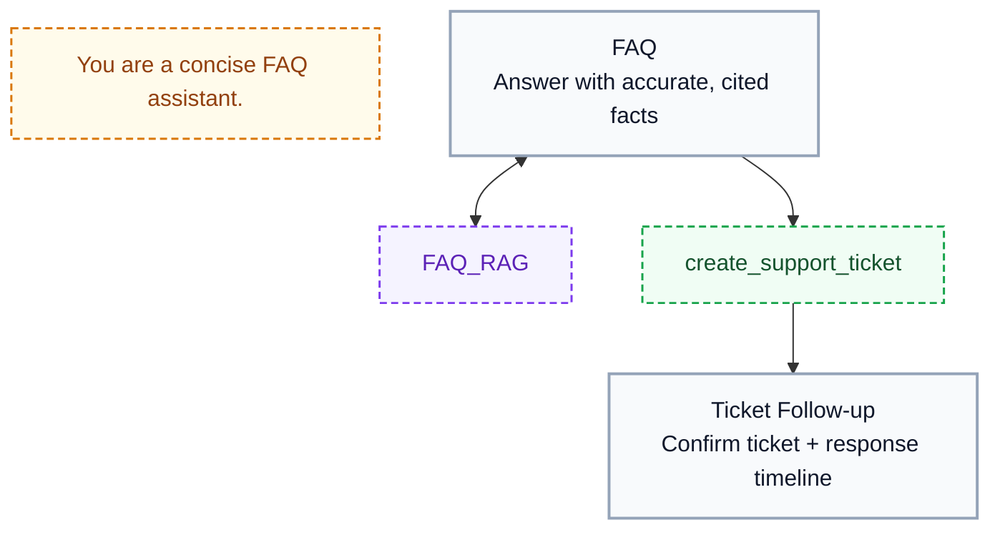
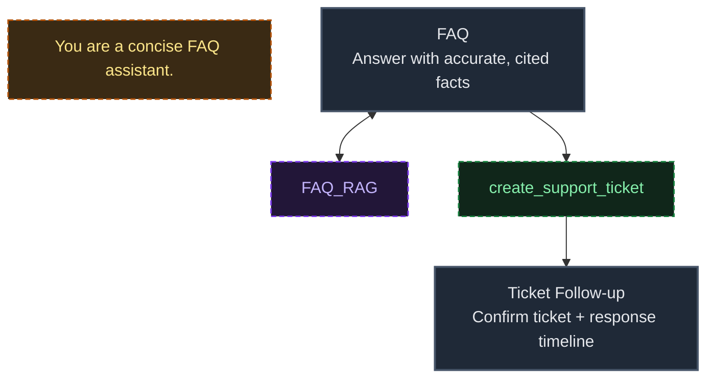
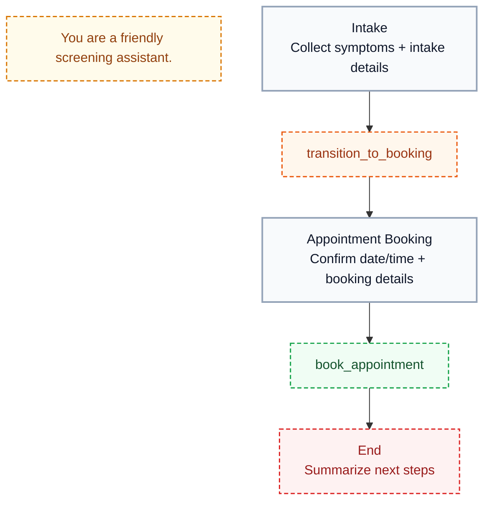
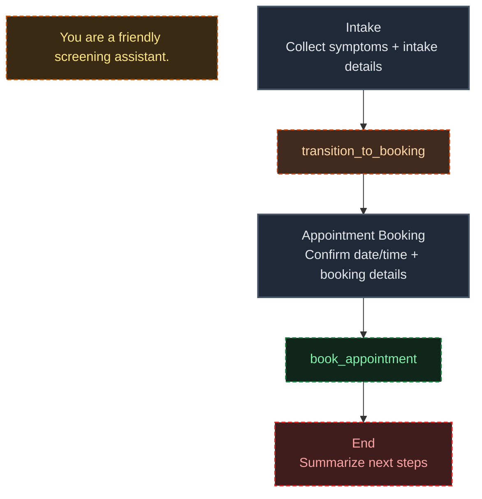

Use this guide when you want to create or edit a scenario directly in JSON.

Use the toggle in the top-right corner of the scenario page to switch between visual mode and JSON mode.

## JSON shape

Every scenario JSON must include:

- `initial_node`: the name of the start node
- `nodes`: an object keyed by node name
- `role_instruction`: one global system instruction for the full scenario

```json
{
  "initial_node": "intro",
  "role_instruction": "You are a friendly Akapulu Labs onboarding assistant. Keep responses concise because they will be converted to audio.",
  "nodes": {
    "intro": {
      "task_instruction": "Greet the user and ask what they want to build.",
    }
  }
}
```

## Top-level fields

- `initial_node` is required and must match an existing node name.
- `role_instruction` is optional and applies globally across the whole conversation.

## Node fields

Each node can include:

- `task_instruction` (required): the instruction for what the assistant should do in that node
- `functions` (optional): tools available in this node
- `respond_immediately` (optional boolean): whether the assistant responds immediately after entering the node. Defaults to `true`
- `end_after_bot_response` (optional boolean): whether the conversation should end after the bot finishes its response in that node
- `require_function_call` (optional boolean): when `true`, the assistant must call **at least one** function from this node's `functions` list. Defaults to omitted / off


## Function shape

Functions are defined directly under a node's `functions` list:

```json
{
  "name": "transition_to_planning",
  "description": "Use this tool when project scope is clear.",
  "type": "transition",
  "transition_to": "planning"
}
```

Allowed function `type` values:

- `transition`
- `http`
- `rag`
- `vision`

## Function type schemas

### `transition`

- `name`: unique function name in the node
- `description`: instruction shown to the LLM that explains when to call this function
- `type`: must be `transition`
- `transition_to`: target node name to move to
- `require_reason` (optional boolean): when `true`, the LLM must pass a `reason` argument when calling the tool. The reason appears in the tool-call payload in the transcript. Useful for debugging transitions, adds a small amount of latency. See [Transition Tools](/guides/tools/transition-tools#require-reason)

Example:

```json
{
  "name": "transition_to_planning",
  "description": "Use this tool when project scope is clear.",
  "type": "transition",
  "transition_to": "planning"
}
```

### `http`

- `name`: unique function name in the node
- `description`: instruction shown to the LLM that explains what the endpoint does and when to call it
- `type`: must be `http`
- `endpoint_id`: ID of a saved HTTP [endpoint](/guides/endpoints/create-endpoint) in your account

Example:

```json
{
  "name": "book_appointment",
  "description": "Create an appointment using the saved endpoint.",
  "type": "http",
  "endpoint_id": "<HTTP_ENDPOINT_ID>"
}
```

### `rag`

- `name`: unique function name in the node
- `description`: instruction shown to the LLM that explains what knowledge this tool retrieves and when to use it
- `type`: must be `rag`
- `knowledge_base_id`: ID of a saved [knowledge base](/guides/knowledge-bases/overview) in your account

Example:

```json
{
  "name": "about_our_clinic",
  "description": "Use this tool for clinic-specific questions.",
  "type": "rag",
  "knowledge_base_id": "<KNOWLEDGE_BASE_ID>"
}
```

### `vision`

- `name`: unique function name in the node
- `description`: instruction shown to the LLM that explains when to inspect user video context
- `type`: must be `vision`

Example:

```json
{
  "name": "view_camera",
  "description": "Use this tool when the user asks you to look at the screen or camera feed.",
  "type": "vision"
}
```

`transition_to` is optional for non-transition tools. If set, the flow will transition to the specified node on tool completion

For HTTP functions, there are two transition patterns:

- Use `transition_to` when the endpoint should always move to the same next node after a successful response.
- Use `allowed_next_nodes` to have Akapulu Labs choose the next node dynamically from the function response. (See [Endpoints](/guides/endpoints/create-endpoint))

## Validation rules

### Core structure

- `nodes_json` is required and must be a JSON object
- `nodes_json` max size is `20000` characters
- top-level keys are limited to `initial_node`, `role_instruction`, and `nodes`
- `nodes` must be a non-empty object
- `initial_node` is required and must match an existing node name
- `initial_node` must reference a node object

### Instruction rules

- `role_instruction`, if provided, must be a non-empty string
- `task_instruction` max length: `4000` characters
- `role_instruction` max length: `4000` characters
- `task_instruction` and `role_instruction` cannot use `secret` or `llm` [template variables](/guides/endpoints/templates-and-variables)

### Node rules

- each node must be a JSON object
- node keys are limited to `task_instruction`, `functions`, `respond_immediately`, `end_after_bot_response`, and `require_function_call`
- every node must include a non-empty `task_instruction`
- `respond_immediately`, if provided, must be a boolean
- `end_after_bot_response`, if provided, must be a boolean
- `require_function_call`, if provided, must be a boolean
- if `require_function_call` is `true`, `functions` must be a list with at least one function
- if `functions` is provided, it must be a list

### Function rules

- `functions` must be a list of direct function objects
- each function must be a JSON object
- function keys are limited to `name`, `description`, `type`, `transition_to`, `allowed_next_nodes`, `endpoint_id`, `knowledge_base_id`, `parameters`, and `require_reason`
- `function.name` is required, must be unique per node, and only allows letters, numbers, `_`, `-`
- `function.name` cannot include leading or trailing whitespace
- `function.description` is required
- `function.type` must be one of `transition`, `http`, `rag`, `vision` and defaults to `transition` if omitted

#### Transition rules

- `transition` functions must define `transition_to`
- `transition_to` must be a string
- `transition_to` must not include leading or trailing whitespace
- if `transition_to` is set, it must target an existing node
- `require_reason`, if provided, must be a boolean
- `require_reason` is only valid for `transition` functions

#### HTTP function rules

- `http` functions must define `endpoint_id`
- `allowed_next_nodes` is only valid for `http` functions
- `http` functions cannot set both `transition_to` and `allowed_next_nodes`
- if `allowed_next_nodes` is set, it must be a non-empty JSON array
- each `allowed_next_nodes` entry must be a non-empty string
- `allowed_next_nodes` entries must not include leading or trailing whitespace
- `allowed_next_nodes` entries must be unique
- each `allowed_next_nodes` entry must reference an existing node
- referenced HTTP endpoints must exist in your account

#### RAG function rules

- `rag` functions must define `knowledge_base_id`
- referenced knowledge bases must exist in your account

### HTTP template rules

- endpoint `headers` and `body` must be JSON objects
- endpoint header values must be strings
- endpoint body values must be strings
- secret variables are not allowed in endpoint body templates, so put secrets in headers
- template variables must use valid `runtime`, `secret`, or `llm` syntax
- `llm` variables must include descriptions
- the same `llm` variable name cannot use conflicting descriptions within one function

## Example scenarios

Replace placeholder IDs like `<KNOWLEDGE_BASE_ID>` and `<HTTP_ENDPOINT_ID>` with values from your Akapulu Labs account.

### 1) Interview coach

<div className="block dark:hidden">



</div>

<div className="hidden dark:block">



</div>

```json
{
  "initial_node": "Intro",
  "role_instruction": "You are a supportive interview coach.",
  "nodes": {
    "Intro": {
      "task_instruction": "Build rapport, ask the target role, and collect interview goals.",
      "functions": [
        {
          "name": "transition_to_practice",
          "description": "Use when goals and role context are clear.",
          "type": "transition",
          "transition_to": "Practice Round"
        }
      ]
    },
    "Practice Round": {
      "task_instruction": "Run mock interview questions and provide concise coaching feedback.",
      "functions": [
        {
          "name": "Interview_RAG",
          "description": "Retrieve interview prep guidance and role-specific best practices.",
          "type": "rag",
          "knowledge_base_id": "<KNOWLEDGE_BASE_ID>"
        }
      ]
    }
  }
}
```

### 2) AI therapist

<div className="block dark:hidden">



</div>

<div className="hidden dark:block">



</div>

```json
{
  "initial_node": "Check-in",
  "role_instruction": "You are a calm, empathetic AI therapist for supportive conversation.",
  "nodes": {
    "Check-in": {
      "task_instruction": "Check in emotionally, reflect feelings, and ask gentle follow-up questions.",
      "functions": [
        {
          "name": "Therapy_Guidelines_RAG",
          "description": "Retrieve grounding and coping guidance from approved therapeutic content.",
          "type": "rag",
          "knowledge_base_id": "<KNOWLEDGE_BASE_ID>"
        },
        {
          "name": "escalate_to_human_support",
          "description": "Escalate to a human support workflow when risk signals are present.",
          "type": "http",
          "endpoint_id": "<HTTP_ENDPOINT_ID>",
          "transition_to": "Human Support Follow-up"
        }
      ]
    },
    "Human Support Follow-up": {
      "task_instruction": "Confirm escalation status and communicate clear next steps."
    }
  }
}
```

### 3) FAQ agent

<div className="block dark:hidden">



</div>

<div className="hidden dark:block">



</div>

```json
{
  "initial_node": "FAQ",
  "role_instruction": "You are a concise FAQ assistant.",
  "nodes": {
    "FAQ": {
      "task_instruction": "Answer product and policy questions with accurate, cited facts.",
      "functions": [
        {
          "name": "FAQ_RAG",
          "description": "Search the FAQ knowledge base for accurate answers.",
          "type": "rag",
          "knowledge_base_id": "<KNOWLEDGE_BASE_ID>"
        },
        {
          "name": "create_support_ticket",
          "description": "Create a support ticket when the answer is not available in the FAQ content.",
          "type": "http",
          "endpoint_id": "<HTTP_ENDPOINT_ID>",
          "transition_to": "Ticket Follow-up"
        }
      ]
    },
    "Ticket Follow-up": {
      "task_instruction": "Share ticket confirmation details and expected response timing."
    }
  }
}
```

### 4) Patient screening + appointment booking

<div className="block dark:hidden">



</div>

<div className="hidden dark:block">



</div>

```json
{
  "initial_node": "Intake",
  "role_instruction": "You are a friendly patient screening assistant.",
  "nodes": {
    "Intake": {
      "task_instruction": "Collect symptoms and basic screening details.",
      "functions": [
        {
          "name": "transition_to_booking",
          "description": "Use when intake details are complete.",
          "type": "transition",
          "transition_to": "Appointment Booking"
        }
      ]
    },
    "Appointment Booking": {
      "task_instruction": "Book the appointment and confirm date and time details.",
      "functions": [
        {
          "name": "book_appointment",
          "description": "Submit appointment details to the scheduling backend.",
          "type": "http",
          "endpoint_id": "<HTTP_ENDPOINT_ID>",
          "transition_to": "End"
        }
      ]
    },
    "End": {
      "task_instruction": "Thank the patient, share the next steps, and keep the closing brief and friendly.",
      "end_after_bot_response": true
    }
  }
}
```
